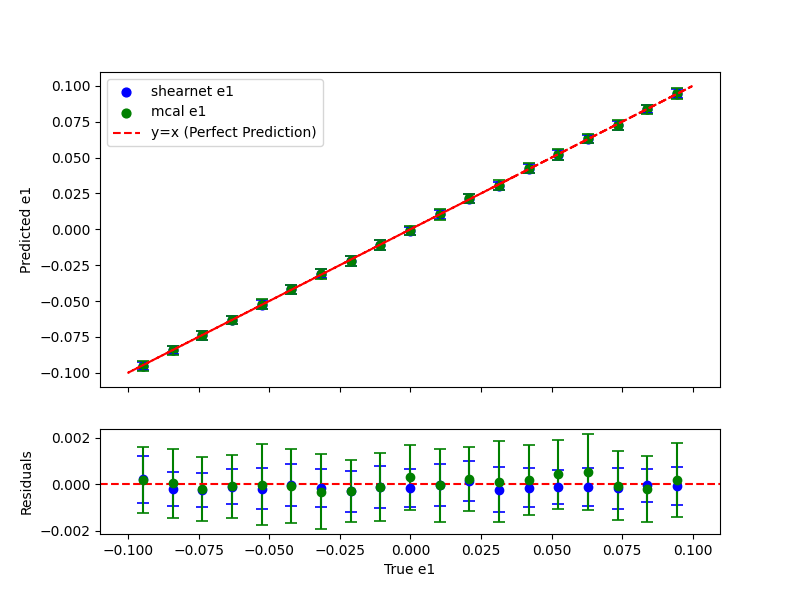

# ShearNet

`shearnet` is a Python library and command-line tool designed to estimate galaxy shears (`e1`, `e2`) using a neural network. The library can simulate galaxy images, train a neural network, and evaluate its performance. It supports GPU computation via JAX.

---

## **Features**

- **Galaxy Simulation**:
  - `shearnet.dataset` enables the simulation of galaxy images with customizable shear and PSF (Point Spread Function) parameters.
  - This module uses powerful libraries like `galsim` and `ngmix` to generate high-quality simulations.

- **Neural Network Training**:
  - `shearnet.train` trains a neural network for shear estimation using simulations created by `shearnet.dataset`.
  - The network architecture is defined in `shearnet.models`, built with the `flax` library.

- **GPU-Accelerated Training**:
  - Training leverages `JAX` for efficient GPU acceleration, with `jax.jit` optimizing training steps.
  - Gradient computations are efficiently managed using JAX's automatic differentiation such as `jax.grad()`.

- **Command-Line Tools**:
  - `shearnet/cli.py` is the primary command-line interface, allowing users to:
    - Configure and run training sessions with customizable arguments.
    - Save trained models for future use.
  - `shearnet/evaluate.py` enables:
    - Loading and evaluating trained models.
    - Analyzing performance through metrics such as Mean Squared Error (MSE) and residual analysis.
    - Comparing neural network results with traditional methods like metacalibration.

- **Result Visualization**:
  - `shearnet/evaluate.py` includes tools for visualizing results, such as:
    - Residual histograms.
    - Side-by-side comparisons of predictions from the neural network and metacalibration techniques.

- **Metacalibration Support**:
  - The `shearnet.mcal` module provides functions for measuring galaxy shear using the conventional metacalibration technique.
  - `shearnet/evaluate.py` integrates metacalibration results for comparison with the neural network's outputs.

- **Device Compatibility**:
  - The framework supports seamless device selection, enabling the use of either CPU or GPU, depending on system availability.

- **Command Aliases**:
  - Simplified command-line execution:
    - Use `shearnet-train` to train models.
    - Use `shearnet-eval` to evaluate and analyze model performance.
  - Detailed instructions are available in the **Usage** section.

## **Example Results**

Below is an example comparison of shear estimation results obtained from `shearnet` and the traditional metacalibration method:


### **Comparison of Predictions**


### **Mean Squared Error (MSE) Comparison**
| Method             | MSE               |
|--------------------|-------------------|
| **Metacalibration** | 2.217 × 10<sup>-6</sup>  |
| **ShearNet**        | 5.554 × 10<sup>-7</sup>  |

ShearNet achieves significantly lower MSE for both `e1` and `e2`, highlighting its superior performance in shear estimation.

---

## **Installation**

1. **Create a new Conda environment:**
    
    ```bash
    conda env create -f sn2025_gpu.yml
    conda activate sn2025_gpu
    ```
    
2. **Install `ngmix`:**
    
    ```bash
    pip install git+https://github.com/esheldon/ngmix.git
    ```
    
3. **Install this package:**
    
    ```bash
    git clone https://github.com/s-Sayan/ShearNet.git
    cd ShearNet
    pip install -e .
    ```
    
4. **Configure the save directory:**
    
    ```bash
    python post_installation.py
    ```
    
    The default directory is the current folder. You can specify another path if needed.
    
5. **Apply changes:**
    
    Restart your terminal or run:
    
    ```bash
    source ~/.bashrc  # For Bash
    source ~/.zshrc   # For Zsh
    ```
---

## **Usage**

### **Train the Model**

After installation, you can train the model using the command-line interface:

```bash
shearnet-train --epochs 50 --batch_size 50 --samples 10000  --psf_fwhm 1.0 --save --model_name test1 --plot --nn simple --patience 20 --plot_training_loss
```
### **Model Evaluation**

After you have successfully trained a model and saved it to the checkpoint directory with a specific model name, you can load up that model and evaluate its performance on a newly generated simulations of test data: 

```bash
shearnet-eval --model_name dense --test_samples 1000 --psf_fwhm 1.0 --plot --mcal
```

### **Command-Line Arguments**

- `-epochs`: Number of training epochs (default: 10).
- `-batch_size`: Batch size for training (default: 32).
- `-samples`: Number of simulated galaxy images (default: 10,000).
- `-psf_fwhm`: PSF full width at half maximum (default: 1.0).
- `--save_path`: Path to save the trained model
- `--load_path`: Path to load the trained model while doing `shearnet-evalulate`
- `--plot`: If selected, plots learning curve, residual histograms and sample comparisons.
---

### **Example Code**

To use the library in Python:

```python
from shearnet.dataset import generate_dataset
from shearnet.train import train_model
import jax.random as random

# Generate dataset
images, labels = generate_dataset(samples=10000, psf_fwhm=1.0)

# Train model
rng_key = random.PRNGKey(42)
train_model(images, labels, rng_key, epochs=10, batch_size=32)
```

---

## **Dependencies**

The following Python packages are required to use `shearnet`:

- **JAX**
- **Flax**
- **Optax**
- **Galsim**
- **Ngmix**
- **NumPy**
- **TQDM**
- **Scipy**
- **Matplotlib**

These will be automatically installed when you run `pip install .`.

---

## **License**

This project is licensed under the MIT License. See the `LICENSE` file for details.

---

## **Contributing**

Contributions are welcome! If you have suggestions or improvements, feel free to submit a pull request or open an issue.

---

## **Acknowledgements**

- This library uses [JAX](https://github.com/google/jax) for high-performance GPU/TPU computations.
- [Flax](https://github.com/google/flax) is used for building and training neural networks.
- [Galsim](https://github.com/GalSim-developers/GalSim) and [Ngmix](https://github.com/esheldon/ngmix) are utilized for simulating galaxy images and handling shear estimation.
