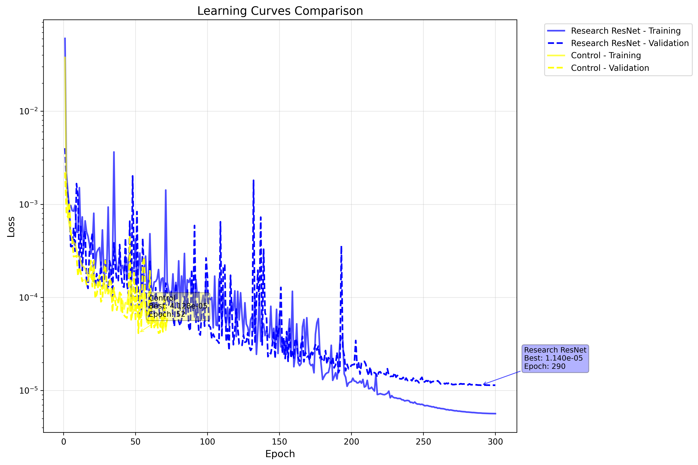
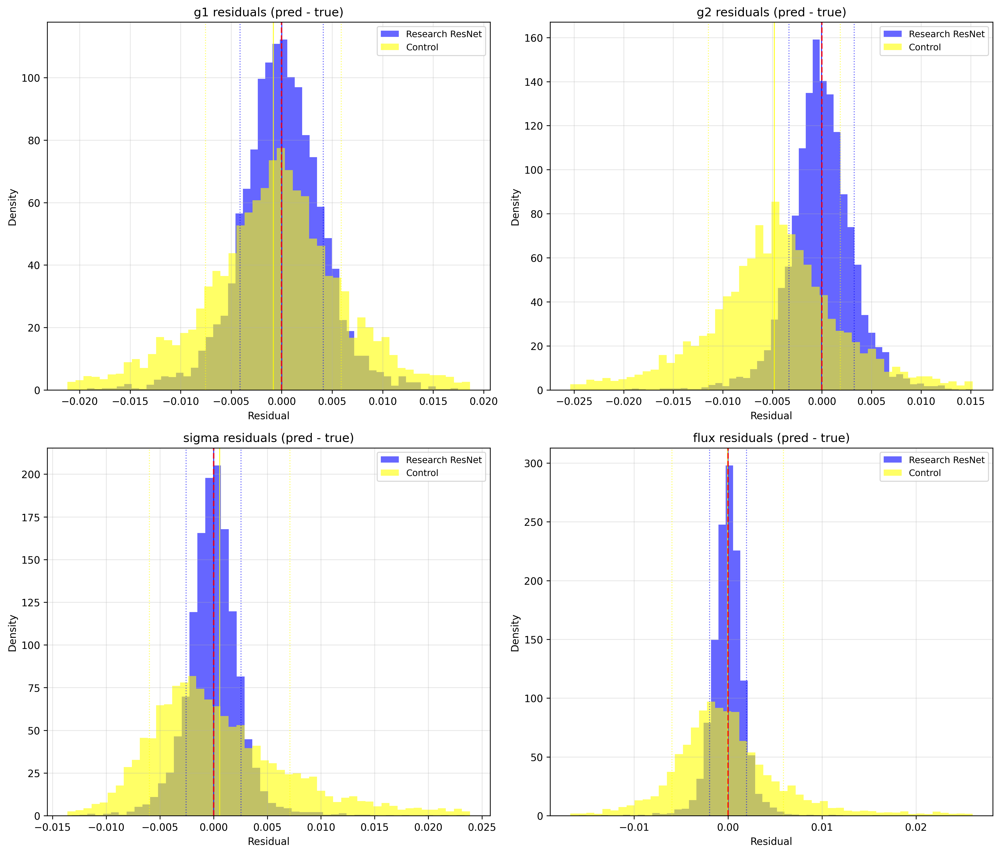
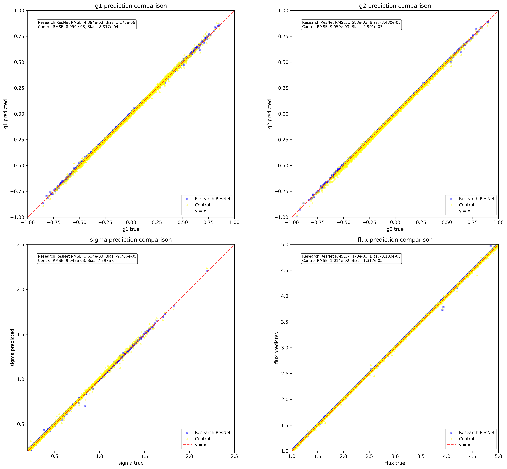
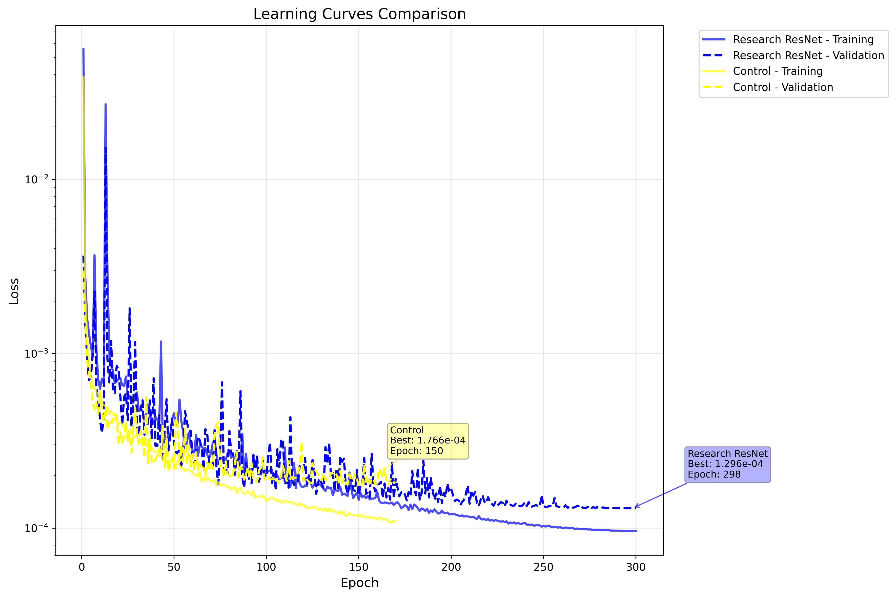
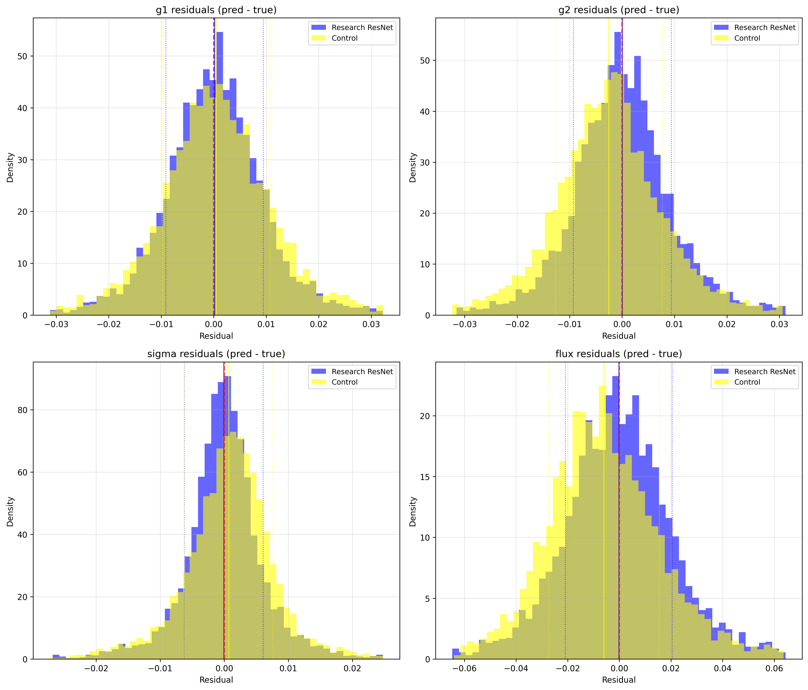

# ShearNet

test

## My Model vs Main Branch Model 

I tweaked the model at [this link](https://github.com/s-Sayan/ShearNet/blob/main/shearnet/core/models.py#L43) based of numerous research papers. The model I refer to is [here](./shearnet/core/models.py#L323). Plotted here is the comparison of the original model vs my new model.

### Low Noise (nse_sd = 1e-5)

The comparison is also housed at [this directory](./notebooks/research_vs_control_low_noise/).

Here is the comparions plots:







### High Noise (nse_sd = 1e-3)

The comparison is also housed at [this directory](./notebooks/research_vs_control_high_noise/).

Here is the comparions plots:



- `-nn`: Model type (`mlp`, `cnn`, `resnet`, `research_backed`, `forklens_psf`, `fork-like`)
- `-mcal`: Compare with metacalibration and NGmix
- `-plot`: Generate plots



## Next Steps

### Comparison of predictions
On 5000 test samples of stamp size 53x53 and pixel size 0.141:
```
| Method                            | MSE (g1, g2)    | Time    |
|-----------------------------------|-----------------|---------|
| ShearNet (research backed)        | ~6.75e-6        | ~6.6s   |
| ShearNet (fork-like)              | ~4e-6           | ~2.5s   |
| Moment-based                      | ~1e-4           | ~142s   |
```

## Requirements

- Python 3.8+
- JAX (CPU/GPU)
- Flax, Optax
- GalSim, NGmix
- NumPy, SciPy, Matplotlib

See `pyproject.toml` for complete list.

## Repository Structure

```
ShearNet/
├── shearnet/
│   ├── core/       # Models, training, dataset
│   ├── methods/    # NGmix, moment-based
│   ├── utils/      # Metrics, plotting
│   └── cli/        # Command-line tools
├── scripts/        # Setup scripts
├── Makefile        # Installation
└── pyproject.toml  # Dependencies

```

## Python API

```python
from shearnet.core.dataset import generate_dataset
from shearnet.core.train import train_modelv2
import jax.random as random

# Generate data
images, labels = generate_dataset(10000, psf_fwhm=0.8)

# Train
rng_key = random.PRNGKey(42)
state, train_losses, val_losses = train_model(
    images, labels, rng_key, epochs=50, nn='cnn'
)
```

## License

MIT License

## Contributing

Contributions welcome! Please submit issues or pull requests.
