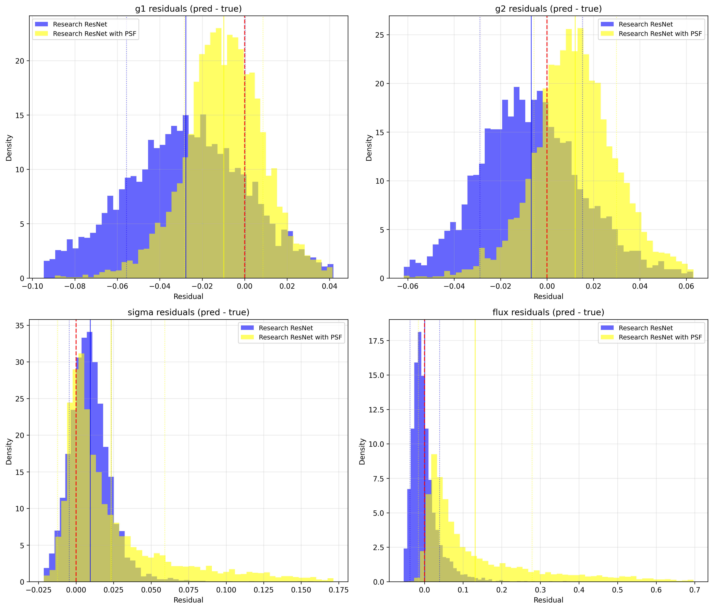

# Dev Notes

Here I will impliment psf images into the training data. This will change the initial shape from (batch_size, 53, 53) to (batch_size, 53, 53, 2).
Training on this should only increase the accuracy of ShearNet, and adding both psf and noise images will put it on even ground with NGMix.  
Note, after reading [Zhang et. al.](https://arxiv.org/abs/2301.02986) I have realized that this will be considered an "early-fusion" approach. This means that I will combine the galaxy and psf images into essentially a single data set that a network then is trained on, rather than Forklens' fork-like approach of having two netwroks, a heavier one for learning the galaxy images and a lighter one for the psf images, then concatinating the results at the end, hence the "late-fusion" of this fork-like structure.  

## Results

The introduction of psf images in the training data seems to introduce some type of bias, specifically in the flux and sigma predictions. Here are the results of my benchmarks.

# Original Galaxy NN

# Research Based Galaxy ResNet

## Analysis

I think the biggest alarm bell in these results is the introduction of a right skew in the residual plots of sigma and flux.  
More generally, there is an introduction of bias in the research based model.  
I think that the introduction of these psf images increased the complexity a lot and caused the research based model to struggle. The original NN weirdly enough seems almost unchanged after the introduction to psf.  

## Next Steps

I look forward to implementing the fork-like structure bsaed on Forklens soon. Seeing the performance of the model under this structure will be insightful, since the Forklens paper provided no benchmarks to justify their fork stucture.  

## License

MIT License

## Contributing

Contributions welcome! Please submit issues or pull requests.
