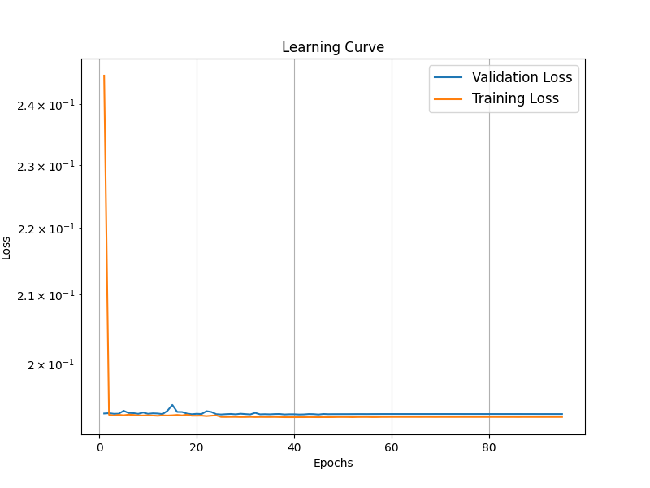

# Intro
This is where I development a mimic of [Forklens'](https://github.com/zhangzzk/forklens) NN architecture and hyperparameters.  
In this directory I document the following changes:
- The learning rate scheduler to Forklens'
- The optimizer to Forklens'
- Added the Forklens' model architecture to models.py.
# Results

## Test 1

In this directory [Forklens](./plots/forklens_new_optimizer+lr_scheduler) I ran the Forklens architecture with the Forklens LR scheduler and optimizer, I got a rather poor performance. The learning and validation curve plateaued immediatly, early stop was triggered at epoch 66/150 (having not improved significantly since epoch 2).  
### Learning curve:

### Residual Plot:

### Scatter Plot:

As seen by the residual plots, its performance on everything is quiet bad. Next I wanted to try and isolate the performance issue, so I ran Forklens' architecture with ShearNet's lr scheduler and optimizer.

## Test 2

In this directory [forklens_old_optimizer+lr_scheduler](./plots/forklens_old_optimizer+lr_scheduler) I ran the Forklens architecture with the ShearNet's LR scheduler and optimizer, nearly identical performance to [test 1](#test-1). The learning and validation curve plateaued immediatly again (with a few tiny spikes), early stop was triggered at epoch 82/150 (having not improved significantly since epoch 2 again).  
I believe the bumpy learning curve to largely be due to the nature of ShearNet's lr scheduler. Or more accurately the extremely flat plateau in [test 1](#test-1) is because of the nature of Forklens' optimizer. They use a [ReduceLROnPlateau](./src/core/train.py#L200) scheduler that is designed to encourage plateaus in the learning curve, reducing the learning rate on plateaus, effectively impairing the NN's ability to learn from improvements.  
### Learning curve:

### Residual Plot:

### Scatter Plot:

As seen by the residual plots, its performance on everything is quiet identical to [test 1](#test-1).

## Test 3  
Confused, I tried running ShearNet's fork-like architecture (research backed on the galaxy images, the original cnn on psf images) with Forklens' lr scheduler and optimizer.

### Learning curve:

### Residual Plot:

### Scatter Plot:

Now in the learning curve plot, something that is very confusing is that the validation loss is above the training loss.  
Beside that, the performance is near indistinguishable in these plots, so let me compare [test 1](test-1) and [test 3's](#test-3) performance.

# Comparison 

## Comparison 1

Here are the plots comparing [test 3](#test-3) and [test 1's](test-1) performance.

### Learning curve:

### Residual Plot:

### Scatter Plot:

## Comparison 2

Here are the plots comparing [test 2](#test-3) and [test 1's](test-1) performance.

### Learning curve:

### Residual Plot:

### Scatter Plot:

## Comparison 3

Here are the plots comparing [test 3](#test-3) and ShearNet's performance on it's own lr scheduler and optimizer.

### Learning curve:

### Residual Plot:

### Scatter Plot:

# Perspective

So as you can see, ShearNet is much better with the cosine decay scheduler and AdamW optimizer. From my testing ShearNet is much better than Forklens at prediction of g1, g2, sigma, flux.  
I was confused by this result, so I turned to the academic paper written by [Zekang Zhang, et. al.](https://arxiv.org/pdf/2301.02986).   

# The Paper

So after reading this paper more thoroughly this time, I realized that Forklens is basically a two step process, similar to ngmix and mcal. Stage 1 of Forklens does as ShearNet does, then stage 2 is a committee of 8 independent MLPs which are trained on true values of g1, g2, sigma, and flux along with their biases. This stage is a calibration phase (quote: "we followed the same formula as Tewes et al. (2019) to perform shear calibration"). This calibration stage outputs one parameter, $g_{\text{meas}}$ the measured unbias shear. 
As for accuracy claims, they mainly focus on the accuracy after their $g_{\text{meas}}$ (after the calbiration stage). The only claims of pre-calibration accuracy is, as stated in the Figure 6 caption: "The accuracy sees a strong dependence on the galaxies' S/N. $\rho = 0.98$ for $\text{S/N} > 10$ comparing $\rho = 0.71$ for $\text{S/N} < 10$" (Zhang et al. 2024). This is in reference to "The residuals of CNN measurement on galaxy ellipticities and magnitude."  
So in my comparison plots not only did I find that the Pearson values are undefined, but that Forklens isn't even learning the task, it predicts zero for g1 and g2 everytime, and it predicts 0.5 and 3 for sigma and flux (the average values respectively). This issue isn't exclusive to either the hyperparameters (lr scheduler and optimizer) or the architecture.