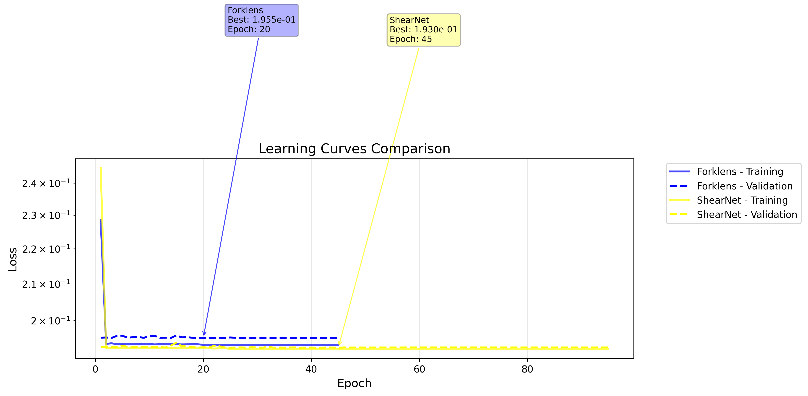
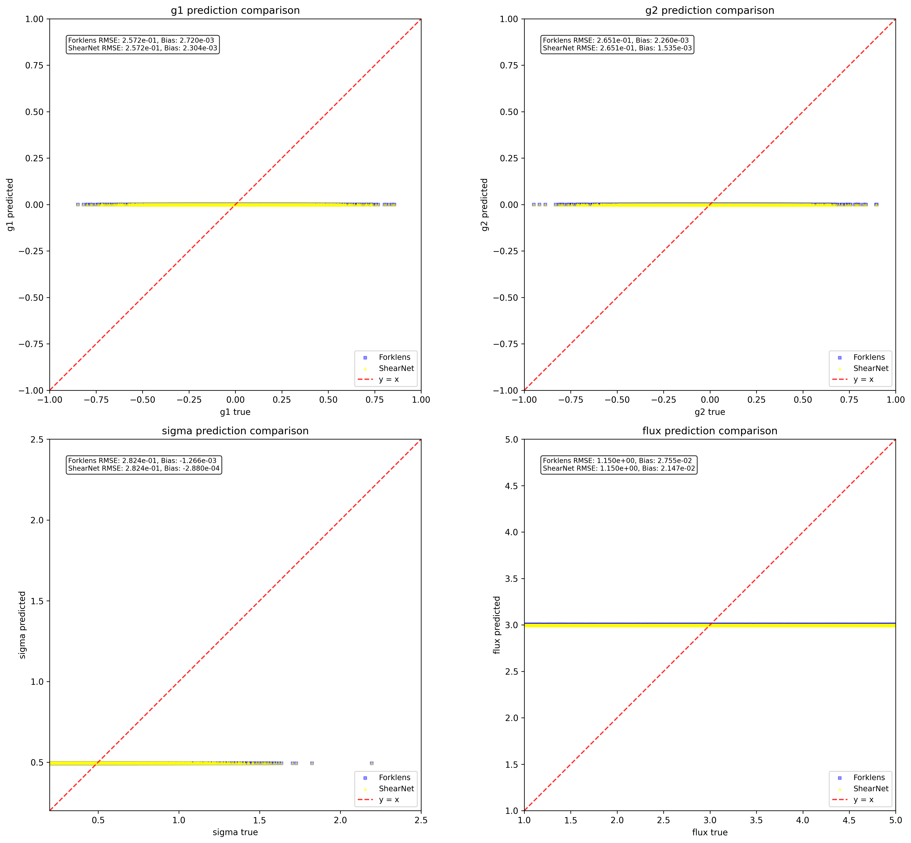
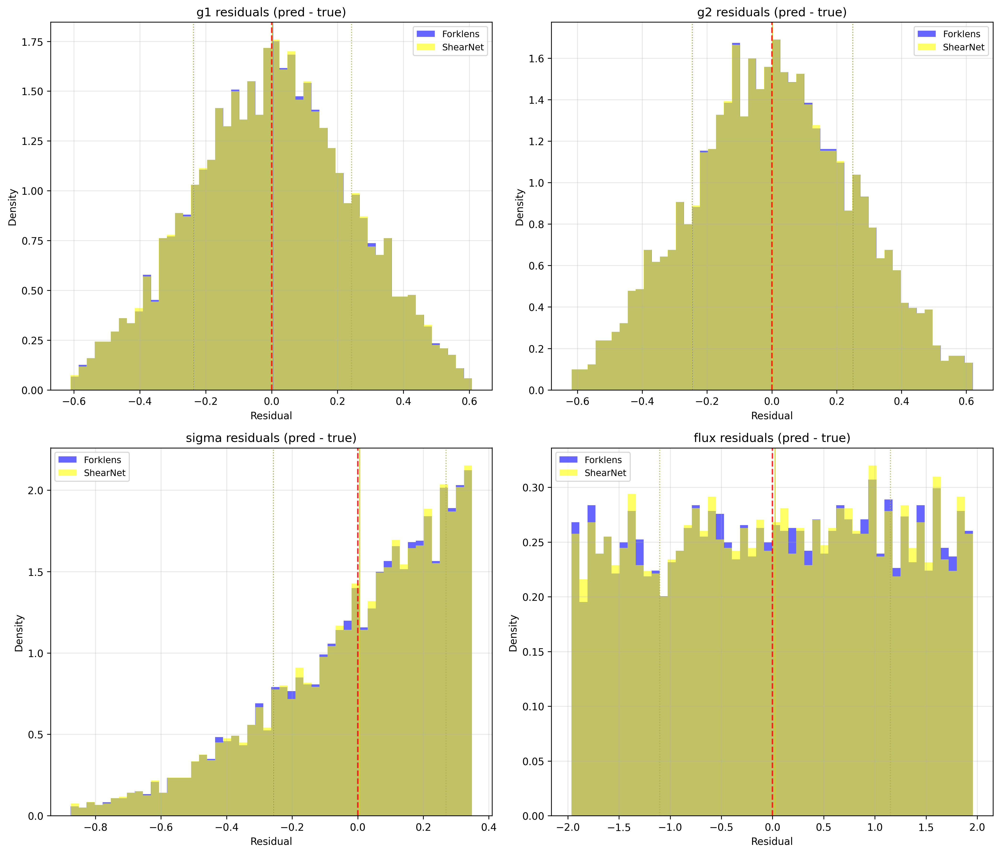

# ShearNet Notebook Output

Generated on: 2025-07-16 04:06:53

Output directory: `/home/adfield/ShearNet/notebooks/out`

---

==================================================

BENCHMARK CONFIGURATION

==================================================

Models to compare: ['Forklens', 'ShearNet']

Include NGMix: False

==================================================


## Test Dataset Generation

Generated 5000 test samples

Galaxy image shape: (5000, 53, 53)

PSF image shape: (5000, 53, 53)

Labels shape: (5000, 4)

```
test_galaxy_images stats: shape=(5000, 53, 53), min=-0.000, max=0.179, mean=0.001, std=0.005
```

```
test_psf_images stats: shape=(5000, 53, 53), min=-0.000, max=0.049, mean=0.000, std=0.003
```

```
test_labels stats: shape=(5000, 4), min=-0.949, max=4.998, mean=0.866, std=1.381
```

---


## Learning Curves Comparison

Forklens:

  Final training loss: 0.193670

  Final validation loss: 0.195466

  Best validation loss: 0.195453 at epoch 20

  Total epochs: 45

ShearNet:

  Final training loss: 0.192614

  Final validation loss: 0.193015

  Best validation loss: 0.192950 at epoch 45

  Total epochs: 95



---


## Model Loading and Evaluation


Evaluating Forklens...


Evaluating ShearNet...


All evaluations complete! Models: ['Forklens', 'ShearNet']

---


## Model Evaluation Summary

============================================================


### EVALUATION SUMMARY

============================================================


Forklens:

  g1   : RMSE = 0.257218, Bias = 0.002720

  g2   : RMSE = 0.265133, Bias = 0.002260

  sigma: RMSE = 0.282365, Bias = -0.001266

  flux : RMSE = 1.150092, Bias = 0.027547


ShearNet:

  g1   : RMSE = 0.257214, Bias = 0.002304

  g2   : RMSE = 0.265127, Bias = 0.001535

  sigma: RMSE = 0.282361, Bias = -0.000288

  flux : RMSE = 1.149742, Bias = 0.021465


Ready for plotting with 2 models

---


## Prediction Comparison Plots



---


## Residuals Comparison Plots



---


## Multi-model benchmark complete!

