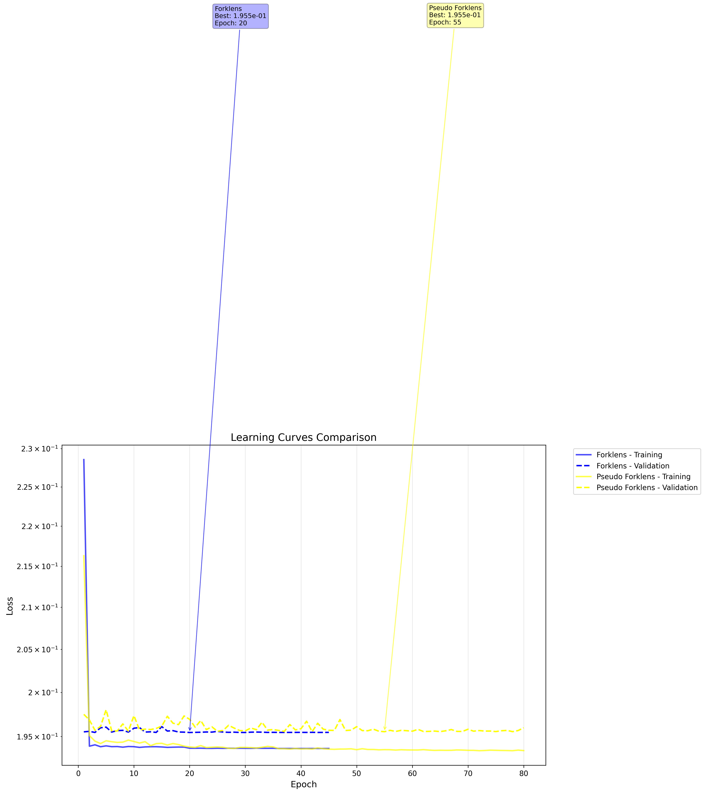
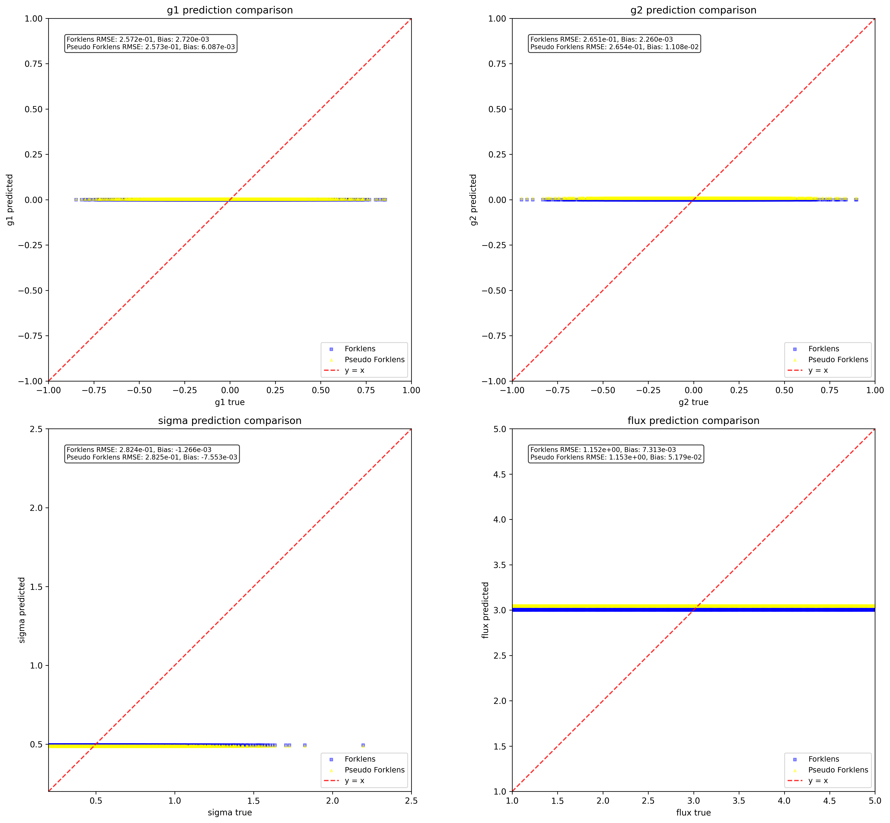
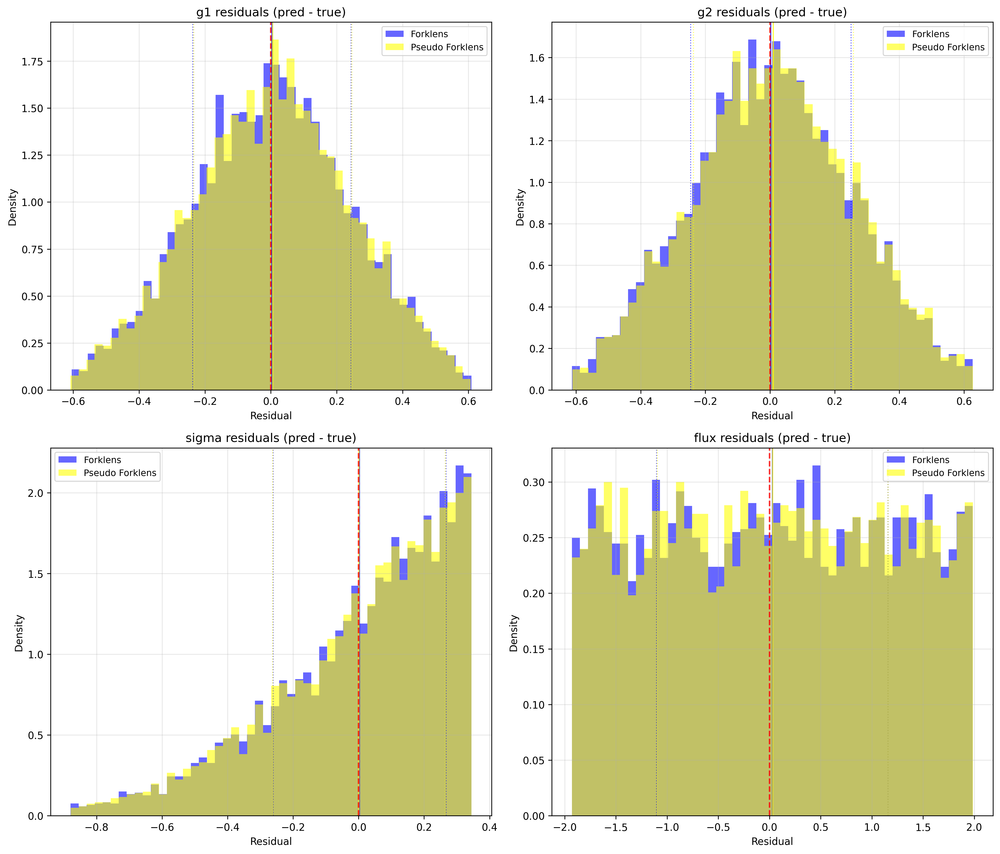

# ShearNet Notebook Output

Generated on: 2025-07-16 04:04:16

Output directory: `/home/adfield/ShearNet/notebooks/out`

---

==================================================

BENCHMARK CONFIGURATION

==================================================

Models to compare: ['Forklens', 'Pseudo Forklens']

Include NGMix: False

==================================================


## Test Dataset Generation

Generated 5000 test samples

Galaxy image shape: (5000, 53, 53)

PSF image shape: (5000, 53, 53)

Labels shape: (5000, 4)

```
test_galaxy_images stats: shape=(5000, 53, 53), min=-0.000, max=0.178, mean=0.001, std=0.005
```

```
test_psf_images stats: shape=(5000, 53, 53), min=-0.000, max=0.049, mean=0.000, std=0.003
```

```
test_labels stats: shape=(5000, 4), min=-0.949, max=4.999, mean=0.871, std=1.390
```

---


## Learning Curves Comparison

Forklens:

  Final training loss: 0.193670

  Final validation loss: 0.195466

  Best validation loss: 0.195453 at epoch 20

  Total epochs: 45

Pseudo Forklens:

  Final training loss: 0.193438

  Final validation loss: 0.195981

  Best validation loss: 0.195546 at epoch 55

  Total epochs: 80



---


## Model Loading and Evaluation


Evaluating Forklens...


Evaluating Pseudo Forklens...


All evaluations complete! Models: ['Forklens', 'Pseudo Forklens']

---


## Model Evaluation Summary

============================================================


### EVALUATION SUMMARY

============================================================


Forklens:

  g1   : RMSE = 0.257218, Bias = 0.002720

  g2   : RMSE = 0.265133, Bias = 0.002260

  sigma: RMSE = 0.282365, Bias = -0.001266

  flux : RMSE = 1.151847, Bias = 0.007313


Pseudo Forklens:

  g1   : RMSE = 0.257276, Bias = 0.006087

  g2   : RMSE = 0.265355, Bias = 0.011076

  sigma: RMSE = 0.282463, Bias = -0.007553

  flux : RMSE = 1.152987, Bias = 0.051788


Ready for plotting with 2 models

---


## Prediction Comparison Plots



---


## Residuals Comparison Plots



---


## Multi-model benchmark complete!

