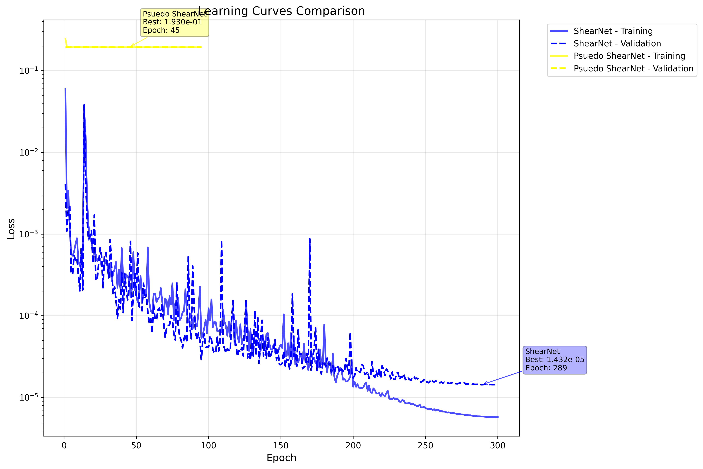
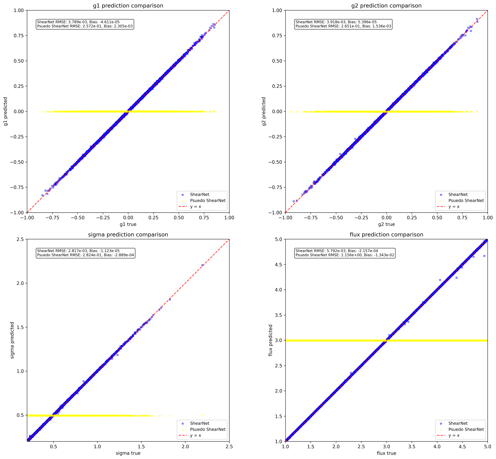
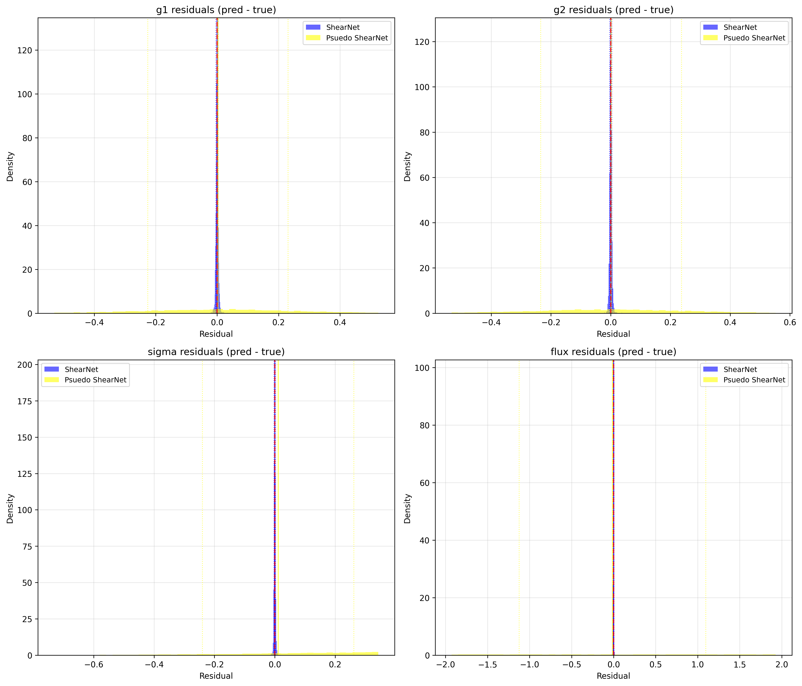

# ShearNet Notebook Output

Generated on: 2025-07-16 04:09:42

Output directory: `/home/adfield/ShearNet/notebooks/out`

---

==================================================

BENCHMARK CONFIGURATION

==================================================

Models to compare: ['ShearNet', 'Psuedo ShearNet']

Include NGMix: False

==================================================


## Test Dataset Generation

Generated 5000 test samples

Galaxy image shape: (5000, 53, 53)

PSF image shape: (5000, 53, 53)

Labels shape: (5000, 4)

```
test_galaxy_images stats: shape=(5000, 53, 53), min=-0.000, max=0.176, mean=0.001, std=0.005
```

```
test_psf_images stats: shape=(5000, 53, 53), min=-0.000, max=0.049, mean=0.000, std=0.003
```

```
test_labels stats: shape=(5000, 4), min=-0.949, max=4.999, mean=0.875, std=1.396
```

---


## Learning Curves Comparison

ShearNet:

  Final training loss: 0.000006

  Final validation loss: 0.000014

  Best validation loss: 0.000014 at epoch 289

  Total epochs: 300

Psuedo ShearNet:

  Final training loss: 0.192614

  Final validation loss: 0.193015

  Best validation loss: 0.192950 at epoch 45

  Total epochs: 95



---


## Model Loading and Evaluation


Evaluating ShearNet...


Evaluating Psuedo ShearNet...


All evaluations complete! Models: ['ShearNet', 'Psuedo ShearNet']

---


## Model Evaluation Summary

============================================================


### EVALUATION SUMMARY

============================================================


ShearNet:

  g1   : RMSE = 0.003789, Bias = -0.000046

  g2   : RMSE = 0.003918, Bias = 0.000054

  sigma: RMSE = 0.002817, Bias = -0.000011

  flux : RMSE = 0.005792, Bias = -0.000216


Psuedo ShearNet:

  g1   : RMSE = 0.257214, Bias = 0.002305

  g2   : RMSE = 0.265127, Bias = 0.001536

  sigma: RMSE = 0.282361, Bias = -0.000289

  flux : RMSE = 1.156446, Bias = -0.013428


Ready for plotting with 2 models

---


## Prediction Comparison Plots



---


## Residuals Comparison Plots



---


## Multi-model benchmark complete!

