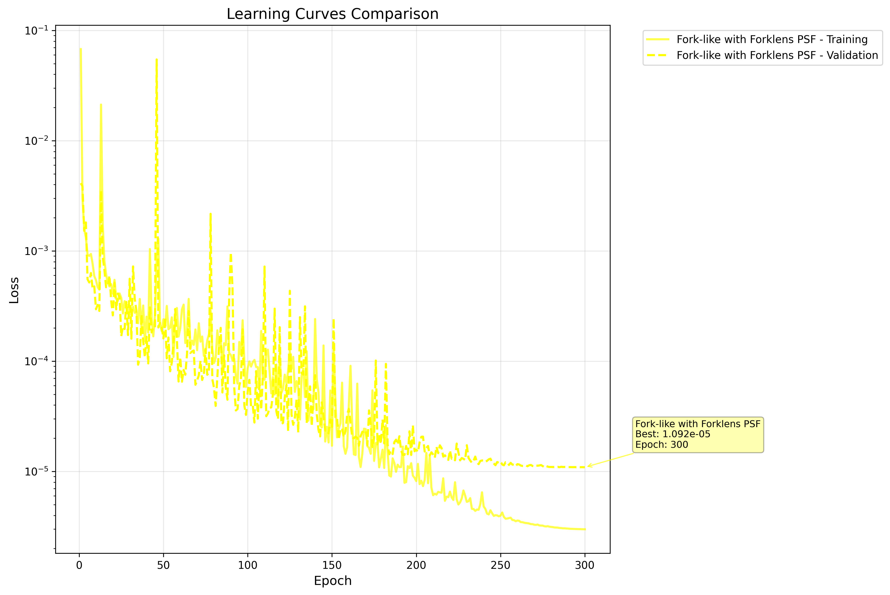
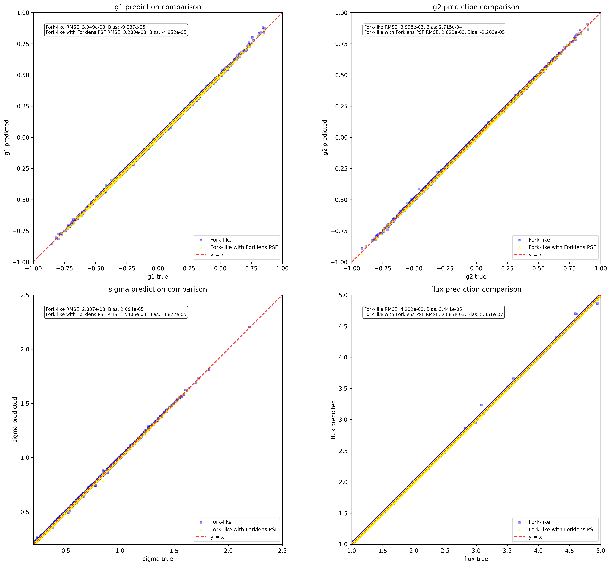
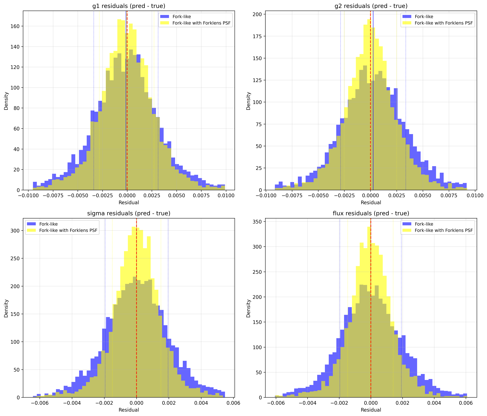

# ShearNet Notebook Output

Generated on: 2025-07-23 01:39:38

Output directory: `/home/adfield/ShearNet/notebooks/out`

---

==================================================

BENCHMARK CONFIGURATION

==================================================

Models to compare: ['Fork-like', 'Fork-like with Forklens PSF']

Include NGMix: False

==================================================


## Test Dataset Generation

Generated 5000 test samples

Galaxy image shape: (5000, 53, 53)

PSF image shape: (5000, 53, 53)

Labels shape: (5000, 4)

```
test_galaxy_images stats: shape=(5000, 53, 53), min=-0.000, max=0.182, mean=0.001, std=0.005
```

```
test_psf_images stats: shape=(5000, 53, 53), min=-0.000, max=0.049, mean=0.000, std=0.003
```

```
test_labels stats: shape=(5000, 4), min=-0.949, max=5.000, mean=0.869, std=1.384
```

---


## Learning Curves Comparison

Warning: Loss file not found for Fork-like: /home/adfield/ShearNet/plots/research_backed+original_cnn/research_backed+original_cnn_loss.npz

Fork-like with Forklens PSF:

  Final training loss: 0.000003

  Final validation loss: 0.000011

  Best validation loss: 0.000011 at epoch 300

  Total epochs: 300



---


## Model Loading and Evaluation


Evaluating Fork-like...


Evaluating Fork-like with Forklens PSF...


All evaluations complete! Models: ['Fork-like', 'Fork-like with Forklens PSF']

---


## Model Evaluation Summary

============================================================


### EVALUATION SUMMARY

============================================================


Fork-like:

  g1   : RMSE = 0.003949, Bias = -0.000090

  g2   : RMSE = 0.003996, Bias = 0.000272

  sigma: RMSE = 0.002837, Bias = 0.000021

  flux : RMSE = 0.004232, Bias = 0.000034


Fork-like with Forklens PSF:

  g1   : RMSE = 0.003280, Bias = -0.000050

  g2   : RMSE = 0.002823, Bias = -0.000022

  sigma: RMSE = 0.002405, Bias = -0.000039

  flux : RMSE = 0.002883, Bias = 0.000001


Ready for plotting with 2 models

---


## Prediction Comparison Plots



---


## Residuals Comparison Plots



---


## Multi-model benchmark complete!

