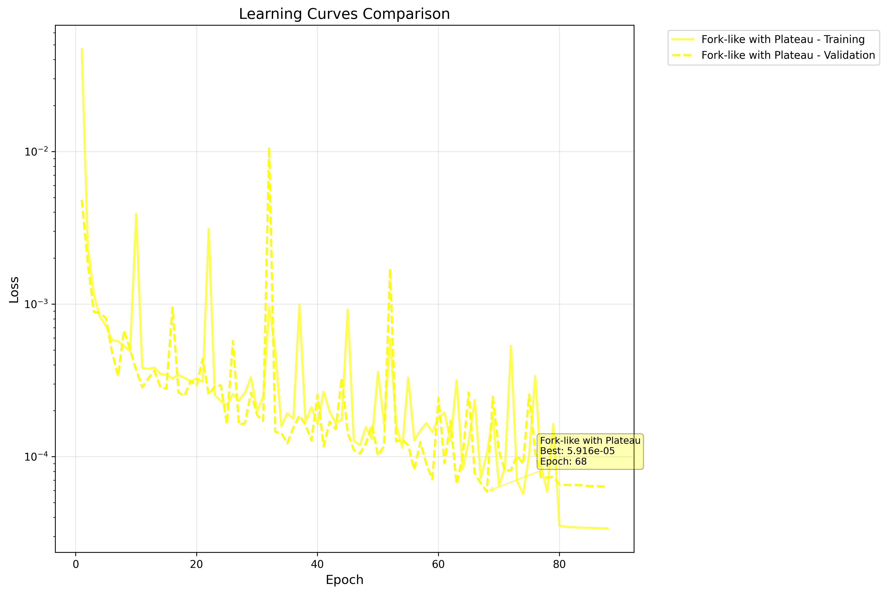
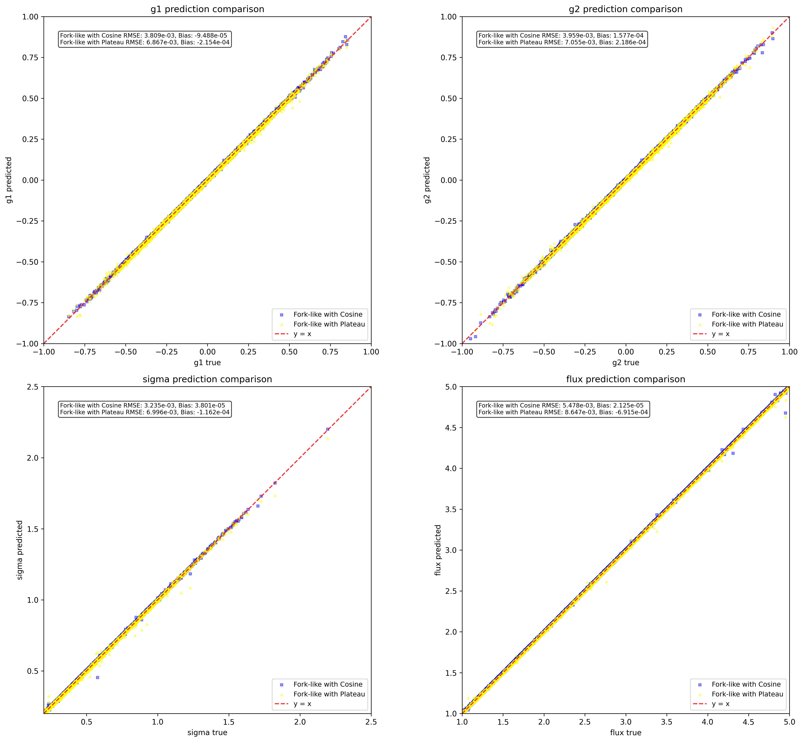
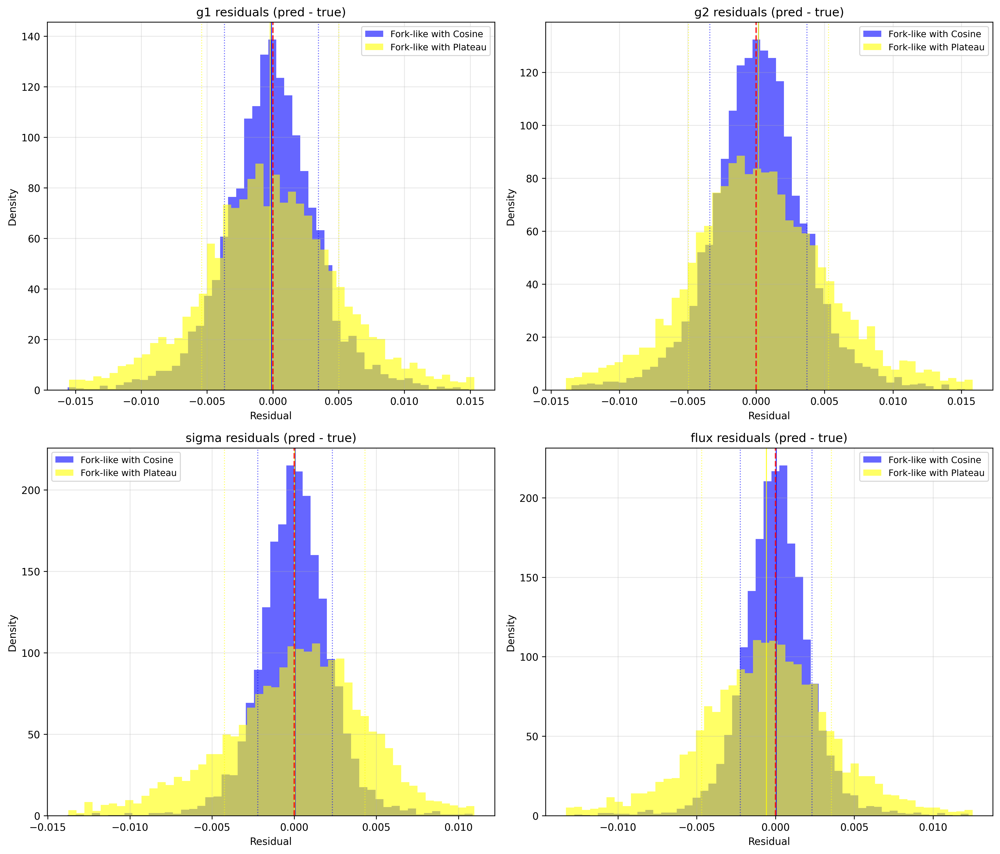

# ShearNet Notebook Output

Generated on: 2025-07-22 23:24:37

Output directory: `/home/adfield/ShearNet/notebooks/out`

---

==================================================

BENCHMARK CONFIGURATION

==================================================

Models to compare: ['Fork-like with Cosine', 'Fork-like with Plateau']

Include NGMix: False

==================================================


## Test Dataset Generation

Generated 5000 test samples

Galaxy image shape: (5000, 53, 53)

PSF image shape: (5000, 53, 53)

Labels shape: (5000, 4)

```
test_galaxy_images stats: shape=(5000, 53, 53), min=-0.000, max=0.182, mean=0.001, std=0.005
```

```
test_psf_images stats: shape=(5000, 53, 53), min=-0.000, max=0.049, mean=0.000, std=0.003
```

```
test_labels stats: shape=(5000, 4), min=-0.949, max=4.999, mean=0.869, std=1.385
```

---


## Learning Curves Comparison

Warning: Loss file not found for Fork-like with Cosine: /home/adfield/ShearNet/plots/research_backed+original_cnn/research_backed+original_cnn_loss.npz

Fork-like with Plateau:

  Final training loss: 0.000034

  Final validation loss: 0.000064

  Best validation loss: 0.000059 at epoch 68

  Total epochs: 88



---


## Model Loading and Evaluation


Evaluating Fork-like with Cosine...


Evaluating Fork-like with Plateau...


All evaluations complete! Models: ['Fork-like with Cosine', 'Fork-like with Plateau']

---


## Model Evaluation Summary

============================================================


### EVALUATION SUMMARY

============================================================


Fork-like with Cosine:

  g1   : RMSE = 0.003809, Bias = -0.000095

  g2   : RMSE = 0.003959, Bias = 0.000158

  sigma: RMSE = 0.003235, Bias = 0.000038

  flux : RMSE = 0.005478, Bias = 0.000021


Fork-like with Plateau:

  g1   : RMSE = 0.006867, Bias = -0.000215

  g2   : RMSE = 0.007055, Bias = 0.000219

  sigma: RMSE = 0.006996, Bias = -0.000116

  flux : RMSE = 0.008647, Bias = -0.000691


Ready for plotting with 2 models

---


## Prediction Comparison Plots



---


## Residuals Comparison Plots



---


## Multi-model benchmark complete!

