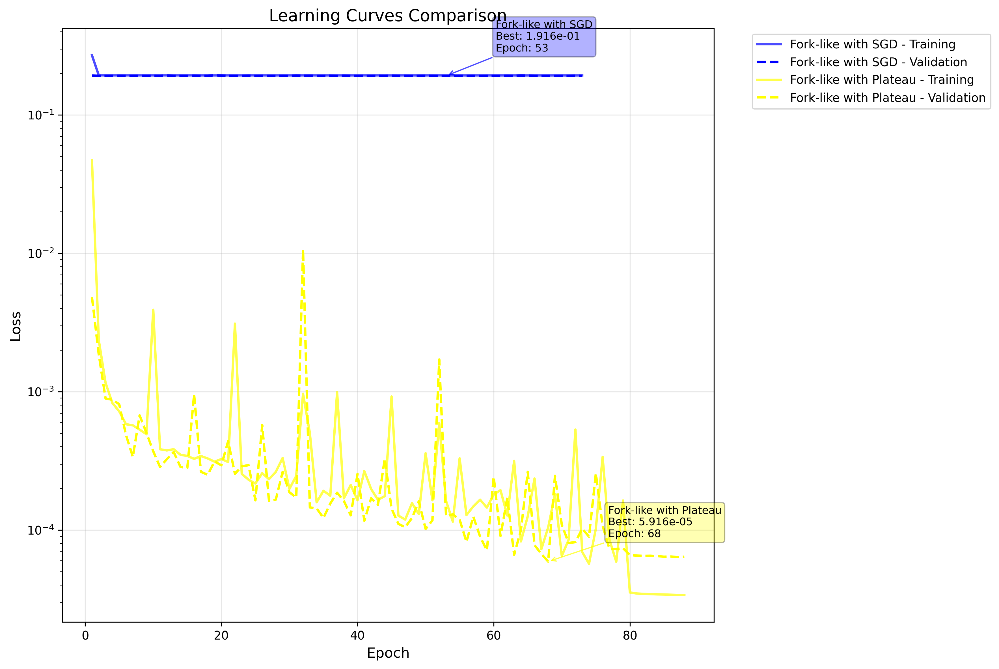
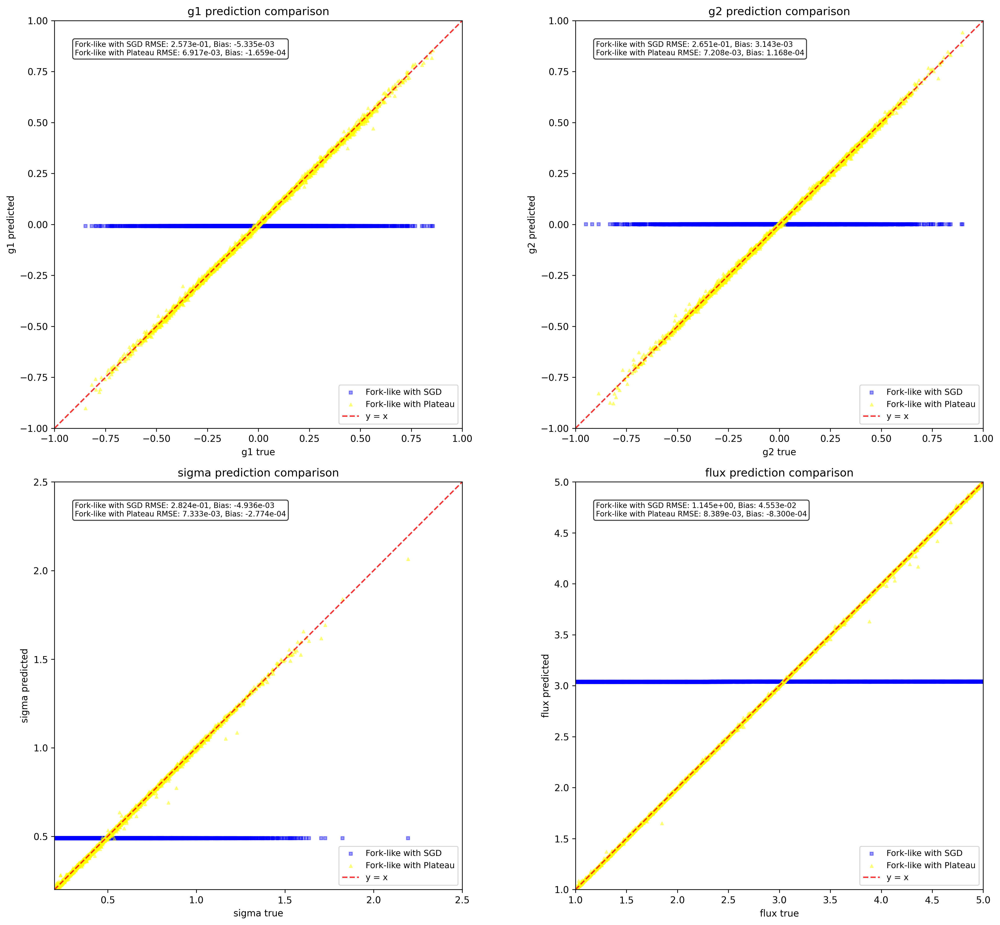
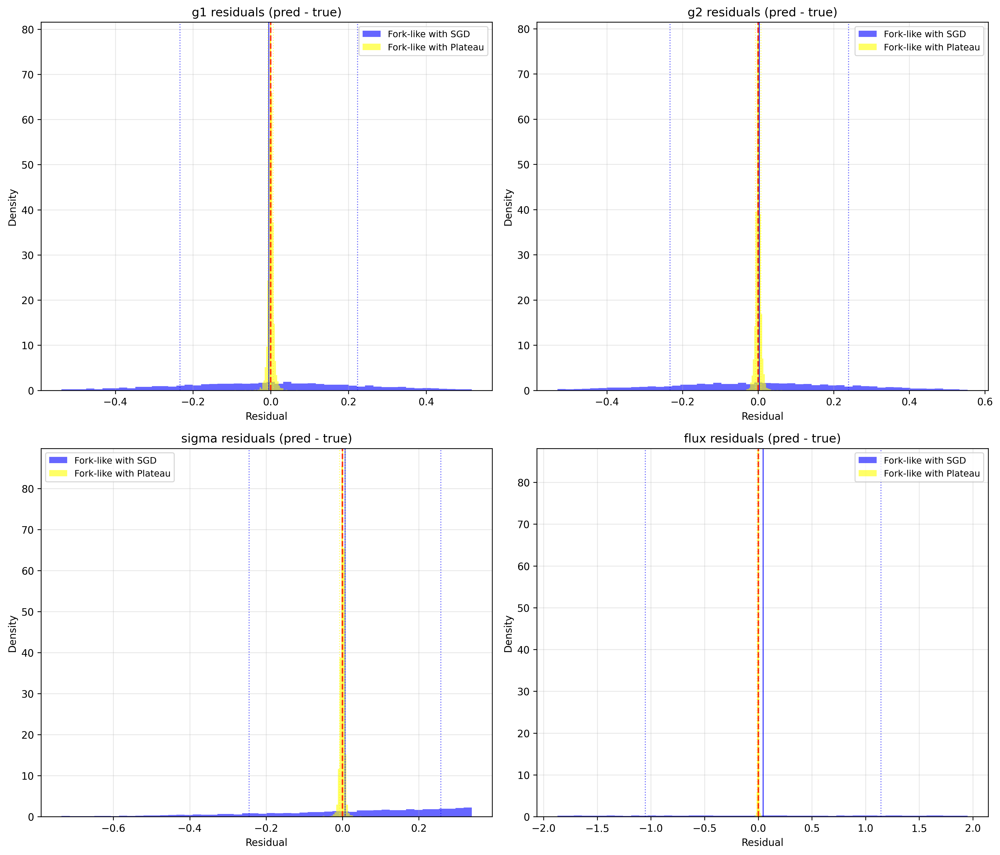

# ShearNet Notebook Output

Generated on: 2025-07-22 23:15:23

Output directory: `/home/adfield/ShearNet/notebooks/out`

---

==================================================

BENCHMARK CONFIGURATION

==================================================

Models to compare: ['Fork-like with SGD', 'Fork-like with Plateau']

Include NGMix: False

==================================================


## Test Dataset Generation

Generated 5000 test samples

Galaxy image shape: (5000, 53, 53)

PSF image shape: (5000, 53, 53)

Labels shape: (5000, 4)

```
test_galaxy_images stats: shape=(5000, 53, 53), min=-0.000, max=0.174, mean=0.001, std=0.005
```

```
test_psf_images stats: shape=(5000, 53, 53), min=-0.000, max=0.049, mean=0.000, std=0.003
```

```
test_labels stats: shape=(5000, 4), min=-0.949, max=4.999, mean=0.871, std=1.387
```

---


## Learning Curves Comparison

Fork-like with SGD:

  Final training loss: 0.192924

  Final validation loss: 0.191741

  Best validation loss: 0.191597 at epoch 53

  Total epochs: 73

Fork-like with Plateau:

  Final training loss: 0.000034

  Final validation loss: 0.000064

  Best validation loss: 0.000059 at epoch 68

  Total epochs: 88



---


## Model Loading and Evaluation


Evaluating Fork-like with SGD...


Evaluating Fork-like with Plateau...


All evaluations complete! Models: ['Fork-like with SGD', 'Fork-like with Plateau']

---


## Model Evaluation Summary

============================================================


### EVALUATION SUMMARY

============================================================


Fork-like with SGD:

  g1   : RMSE = 0.257259, Bias = -0.005335

  g2   : RMSE = 0.265142, Bias = 0.003143

  sigma: RMSE = 0.282397, Bias = -0.004936

  flux : RMSE = 1.145180, Bias = 0.045533


Fork-like with Plateau:

  g1   : RMSE = 0.006917, Bias = -0.000166

  g2   : RMSE = 0.007208, Bias = 0.000117

  sigma: RMSE = 0.007333, Bias = -0.000277

  flux : RMSE = 0.008389, Bias = -0.000830


Ready for plotting with 2 models

---


## Prediction Comparison Plots



---


## Residuals Comparison Plots



---


## Multi-model benchmark complete!

