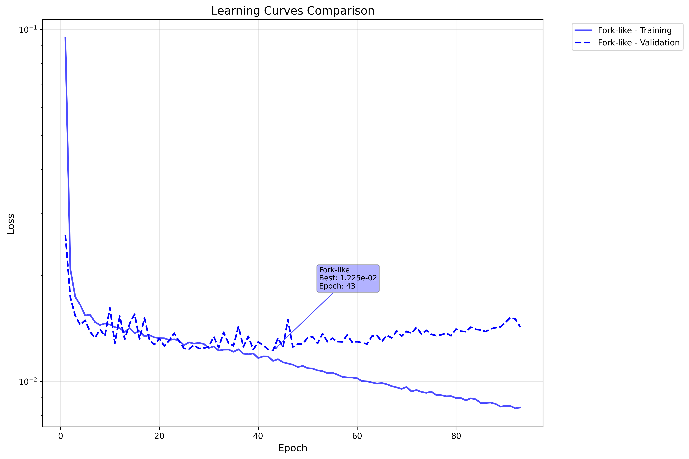
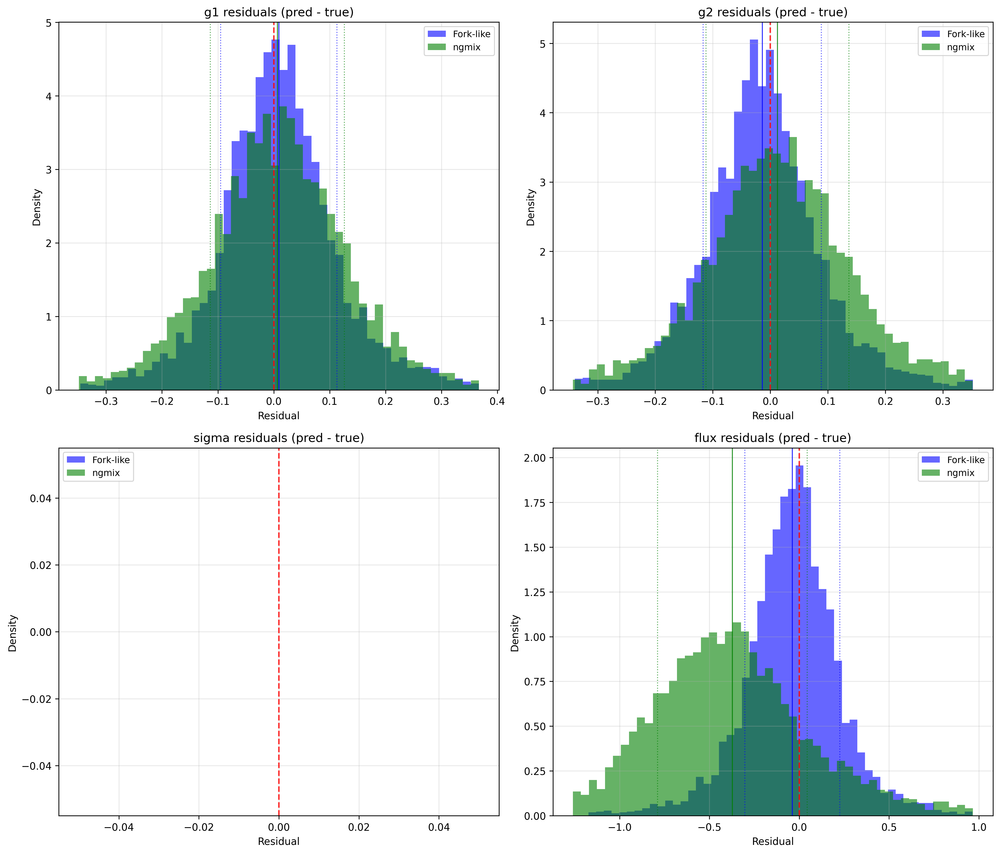

# ShearNet Notebook Output

Generated on: 2025-09-03 04:48:26

Output directory: `/home/adfield/ShearNet/notebooks/out`

---

============================================================


## MODULAR BENCHMARK CONFIGURATION

============================================================

ShearNet models to compare: ['Fork-like']

NGmix configs to compare: ['ngmix']

Total methods to evaluate: 2

============================================================


## Test Dataset Generation

Generated 5000 shared test samples for plotting

Galaxy image shape: (5000, 53, 53)

PSF image shape: (5000, 53, 53)

Labels shape: (5000, 4)

```
test_galaxy_images stats: shape=(5000, 53, 53), min=-0.000, max=0.177, mean=0.001, std=0.005
```

```
test_psf_images stats: shape=(5000, 53, 53), min=-0.000, max=0.049, mean=0.000, std=0.003
```

```
test_labels stats: shape=(5000, 4), min=-0.949, max=5.000, mean=0.867, std=1.383
```

---


## Learning Curves Comparison

Fork-like training stats:

  Final training loss: 0.008434

  Final validation loss: 0.014277

  Best validation loss: 0.012246 at epoch 43

  Total epochs: 93



---


## Model Loading and Evaluation


### 
Evaluating Fork-like...

Loading training config for Fork-like: /home/adfield/ShearNet/plots/fork-like_9-4_meeting/training_config.yaml

Generating test data for Fork-like:

  Samples: 5000

  PSF sigma: 0.25

  Noise SD: 0.01

  Experiment: superbit

  Stamp size: 53

  Pixel size: 0.141

  PSF shear: False

  Process PSF: True

Loading architecture from: /home/adfield/ShearNet/plots/fork-like_9-4_meeting/architecture.py

Model type: fork-like

Galaxy type: research_backed, PSF type: forklens_psf

Successfully loaded model: ForkLike

Found 1 matching directories for Fork-like: ['fork-like_9-4_meeting93']

Loading Fork-like from: /home/adfield/ShearNet/model_checkpoint/fork-like_9-4_meeting93

Model checkpoint loaded successfully.

Successfully evaluated Fork-like

  MSE: 1.426e-02

  Bias: -1.180e-02


### 
Evaluating 1 NGmix configurations...


### 
Evaluating ngmix...

Generating test data for ngmix:

  Samples: 5000

  PSF σ: 0.25

  Noise SD: 1.0e-02

  Experiment: superbit

  Galaxy type: gauss

  PSF shear: False

Evaluating ngmix with gauss/gauss models...

Successfully evaluated ngmix

  MSE: 5.743e-02

  Bias: -4.873e-02


All evaluations complete! Methods: ['Fork-like', 'ngmix']

---


## Model Evaluation Summary

============================================================


### EVALUATION SUMMARY

============================================================


Fork-like (SHEARNET):

  Test Configuration:

    Samples: 5000

    PSF σ: 0.25

    Noise SD: 1.0e-02

    Experiment: superbit

    PSF Shear: False

  Performance:

    Overall MSE: 1.426e-02

    Overall Bias: -1.180e-02

    g1 MSE: 6.902e-03

    g2 MSE: 6.703e-03

    σ MSE: 3.941e-03

    Flux MSE: 3.948e-02

    Evaluation Time: 33.25 seconds


ngmix (NGMIX):

  Test Configuration:

    Samples: 5000

    PSF σ: 0.25

    Noise SD: 1.0e-02

    Experiment: superbit

    PSF Shear: False

    Galaxy Type: gauss

    PSF Model: gauss

    Galaxy Model: gauss

  Performance:

    Overall MSE: 5.743e-02

    Overall Bias: -4.873e-02

    g1 MSE: 9.569e-03

    g2 MSE: 9.745e-03

    σ MSE: 2.876e-02

    Flux MSE: 1.816e-01

    Evaluation Time: 128.35 seconds


Ready for plotting with 2 methods

---


## Prediction Comparison Plots


---


## Residuals Comparison Plots



---


## Future Analysis Section

============================================================


### FUTURE ANALYSIS CAPABILITIES

============================================================

This section is reserved for future additional analysis and plots.

You can add new analysis here without changing the existing plots above.


Potential future features to add:

- Configuration impact analysis (noise level vs performance)

- Method comparison tables with statistical significance tests

- Performance vs computational cost scatter plots

- Bias vs noise level correlation analysis

- PSF shear impact visualization

- Galaxy type performance comparison

- Training configuration clustering analysis


To add new analysis, simply add code in this section.

The modular structure provides access to:

- all_results: ['Fork-like', 'ngmix']

- all_configs: ['Fork-like']

- Individual test configurations for each method

- Both shared and fair evaluation results for comprehensive analysis


Successfully evaluated: 1 ShearNet models, 1 NGmix configs

---


## Modular benchmark complete!

