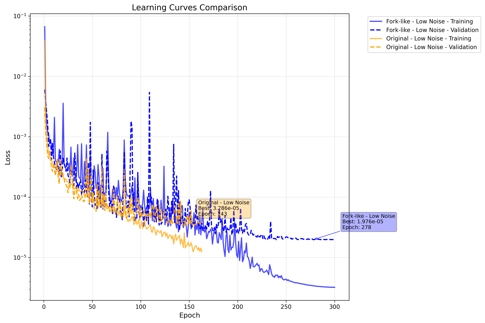
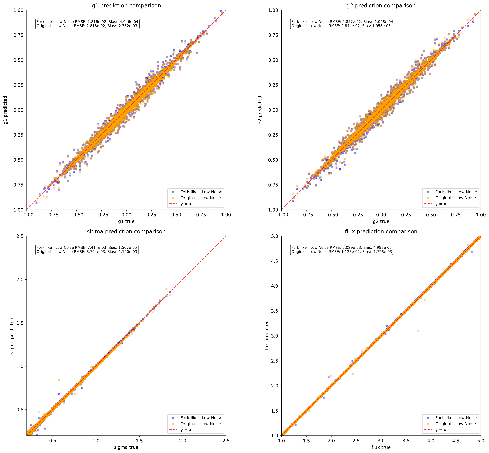
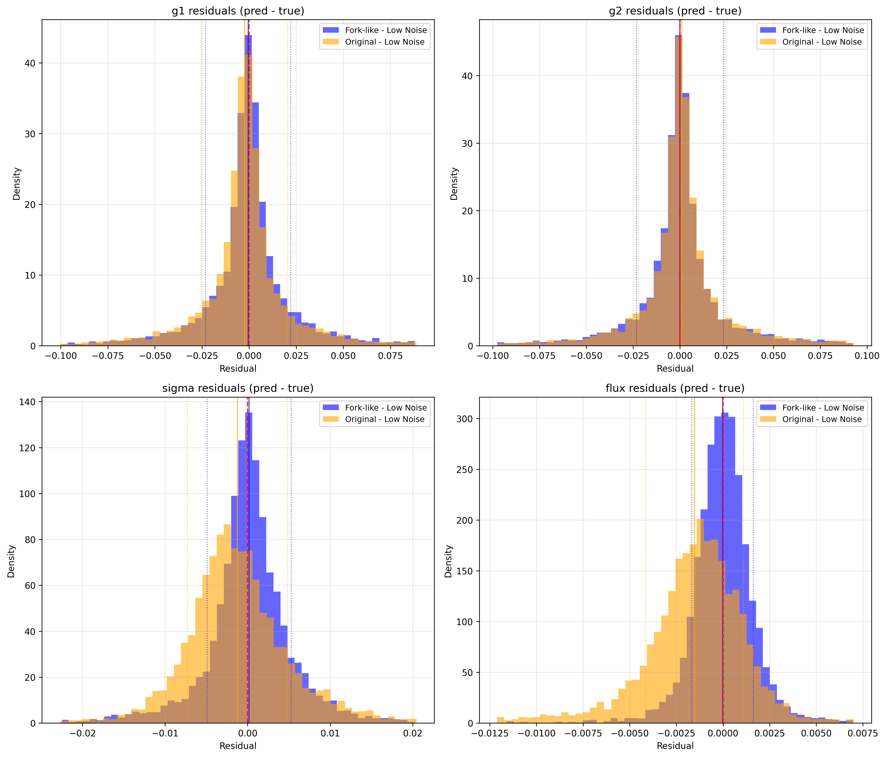

# ShearNet Notebook Output

Generated on: 2025-08-16 16:57:18

Output directory: `/home/adfield/ShearNet/notebooks/out`

---

============================================================


## MODULAR BENCHMARK CONFIGURATION

============================================================

ShearNet models to compare: ['Fork-like - Low Noise', 'Original - Low Noise']

NGmix configs to compare: NO NGMIX

Total methods to evaluate: 2

============================================================


## Test Dataset Generation

Generated 5000 shared test samples for plotting

Galaxy image shape: (5000, 53, 53)

PSF image shape: (5000, 53, 53)

Labels shape: (5000, 4)

```
test_galaxy_images stats: shape=(5000, 53, 53), min=-0.000, max=0.179, mean=0.001, std=0.005
```

```
test_psf_images stats: shape=(5000, 53, 53), min=-0.000, max=0.049, mean=0.000, std=0.003
```

```
test_labels stats: shape=(5000, 4), min=-0.949, max=5.000, mean=0.871, std=1.390
```

---


## Learning Curves Comparison

Fork-like - Low Noise training stats:

  Final training loss: 0.000003

  Final validation loss: 0.000020

  Best validation loss: 0.000020 at epoch 278

  Total epochs: 300

Original - Low Noise training stats:

  Final training loss: 0.000013

  Final validation loss: 0.000039

  Best validation loss: 0.000033 at epoch 143

  Total epochs: 163



---


## Model Loading and Evaluation


### 
Evaluating Fork-like - Low Noise...

Loading training config for Fork-like - Low Noise: /home/adfield/ShearNet/plots/fork-like_low_noise/training_config.yaml

Generating test data for Fork-like - Low Noise:

  Samples: 5000

  PSF sigma: 0.25

  Noise SD: 1e-05

  Experiment: ideal

  Stamp size: 53

  Pixel size: 0.141

  PSF shear: True

  Process PSF: True

Loading architecture from: /home/adfield/ShearNet/plots/fork-like_low_noise/architecture.py

Model type: fork-like

Galaxy type: research_backed, PSF type: forklens_psf

Successfully loaded model: ForkLike

Found 1 matching directories for Fork-like - Low Noise: ['fork-like_low_noise300']

Loading Fork-like - Low Noise from: /home/adfield/ShearNet/model_checkpoint/fork-like_low_noise300

Model checkpoint loaded successfully.

Successfully evaluated Fork-like - Low Noise

  MSE: 2.111e-04

  Bias: -1.116e-04


### 
Evaluating Original - Low Noise...

Loading training config for Original - Low Noise: /home/adfield/ShearNet/plots/original_low_noise/training_config.yaml

Generating test data for Original - Low Noise:

  Samples: 5000

  PSF sigma: 0.25

  Noise SD: 1e-05

  Experiment: ideal

  Stamp size: 53

  Pixel size: 0.141

  PSF shear: True

  Process PSF: False

Loading architecture from: /home/adfield/ShearNet/plots/original_low_noise/architecture.py

Model type: cnn

Successfully loaded model: EnhancedGalaxyNN

Found 1 matching directories for Original - Low Noise: ['original_low_noise163']

Loading Original - Low Noise from: /home/adfield/ShearNet/model_checkpoint/original_low_noise163

Model checkpoint loaded successfully.

Successfully evaluated Original - Low Noise

  MSE: 2.255e-04

  Bias: -1.130e-03


### 
No NGmix configurations to evaluate.


All evaluations complete! Methods: ['Fork-like - Low Noise', 'Original - Low Noise']

---


## Model Evaluation Summary

============================================================


### EVALUATION SUMMARY

============================================================


Fork-like - Low Noise (SHEARNET):

  Test Configuration:

    Samples: 5000

    PSF σ: 0.25

    Noise SD: 1.0e-05

    Experiment: ideal

    PSF Shear: True

  Performance:

    Overall MSE: 2.111e-04

    Overall Bias: -1.116e-04

    g1 MSE: 3.964e-04

    g2 MSE: 4.081e-04

    σ MSE: 2.748e-05

    Flux MSE: 1.264e-05

    Evaluation Time: 27.20 seconds


Original - Low Noise (SHEARNET):

  Test Configuration:

    Samples: 5000

    PSF σ: 0.25

    Noise SD: 1.0e-05

    Experiment: ideal

    PSF Shear: True

  Performance:

    Overall MSE: 2.255e-04

    Overall Bias: -1.130e-03

    g1 MSE: 3.957e-04

    g2 MSE: 4.045e-04

    σ MSE: 3.867e-05

    Flux MSE: 6.305e-05

    Evaluation Time: 1.58 seconds


Ready for plotting with 2 methods

---


## Prediction Comparison Plots



---


## Residuals Comparison Plots



---


## Future Analysis Section

============================================================


### FUTURE ANALYSIS CAPABILITIES

============================================================

This section is reserved for future additional analysis and plots.

You can add new analysis here without changing the existing plots above.


Potential future features to add:

- Configuration impact analysis (noise level vs performance)

- Method comparison tables with statistical significance tests

- Performance vs computational cost scatter plots

- Bias vs noise level correlation analysis

- PSF shear impact visualization

- Galaxy type performance comparison

- Training configuration clustering analysis


To add new analysis, simply add code in this section.

The modular structure provides access to:

- all_results: ['Fork-like - Low Noise', 'Original - Low Noise']

- all_configs: ['Fork-like - Low Noise', 'Original - Low Noise']

- Individual test configurations for each method

- Both shared and fair evaluation results for comprehensive analysis


Successfully evaluated: 2 ShearNet models, 0 NGmix configs

---


## Modular benchmark complete!

