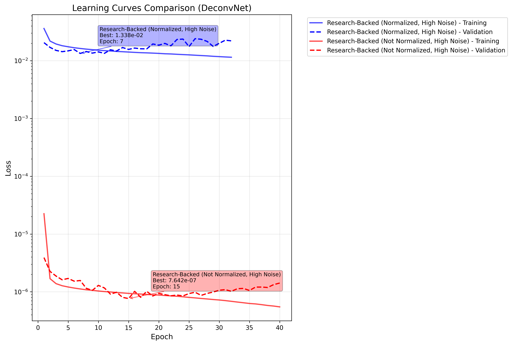

# ShearNet Notebook Output

Generated on: 2025-10-05 20:20:16

Output directory: `/home/adfield/ShearNet/notebooks/out`

---

============================================================


## DECONVNET COMPARISON CONFIGURATION

============================================================

DeconvNet models to compare: ['Research-Backed (Normalized, High Noise)', 'Research-Backed (Not Normalized, High Noise)']

GalSim configs to compare: NO GALSIM

Total methods to evaluate: 2

============================================================


## Test Dataset Generation

Generated 5000 shared test samples for plotting

Galaxy image shape: (5000, 53, 53)

PSF image shape: (5000, 53, 53)

Target image shape: (5000, 53, 53)

```
test_galaxy_images stats: shape=(5000, 53, 53), min=-0.000, max=0.182, mean=0.001, std=0.005
```

```
test_psf_images stats: shape=(5000, 53, 53), min=-0.000, max=0.049, mean=0.000, std=0.003
```

```
test_target_images stats: shape=(5000, 53, 53), min=-0.000, max=0.695, mean=0.001, std=0.007
```

---


## Learning Curves Comparison

Research-Backed (Normalized, High Noise) training stats:

  Final training loss: 0.011488

  Final validation loss: 0.022064

  Best validation loss: 0.013379 at epoch 7

  Total epochs: 32

Research-Backed (Not Normalized, High Noise) training stats:

  Final training loss: 0.000001

  Final validation loss: 0.000001

  Best validation loss: 0.000001 at epoch 15

  Total epochs: 40



---


## Model Loading and Evaluation


### 
Evaluating Research-Backed (Normalized, High Noise)...

Loading training config for Research-Backed (Normalized, High Noise): /home/adfield/ShearNet/plots/research_backed_ideal_normalized_high-noise/training_config.yaml

Generating test data for Research-Backed (Normalized, High Noise):

  Samples: 5000

  PSF sigma: 0.25

  Noise SD: 0.01

  Normalized: True

  Experiment: ideal

  Stamp size: 53

  Pixel size: 0.141

  PSF shear: True

Loading architecture from: /home/adfield/ShearNet/plots/research_backed_ideal_normalized_high-noise/architecture.py

Model type: research_backed

Successfully loaded model: ResearchBackedPSFDeconvolutionUNet

Found 1 matching directories for Research-Backed (Normalized, High Noise): ['research_backed_ideal_normalized_high-noise32']

Loading Research-Backed (Normalized, High Noise) from: /home/adfield/ShearNet/model_checkpoint/research_backed_ideal_normalized_high-noise32

Model checkpoint loaded successfully.

Successfully evaluated Research-Backed (Normalized, High Noise)

  MSE: 4.194e-02

  PSNR: 52.54 dB

  SSIM: 0.9089


### 
Evaluating Research-Backed (Not Normalized, High Noise)...

Loading training config for Research-Backed (Not Normalized, High Noise): /home/adfield/ShearNet/plots/research_backed_ideal_not-normalized_high-noise/training_config.yaml

Generating test data for Research-Backed (Not Normalized, High Noise):

  Samples: 5000

  PSF sigma: 0.25

  Noise SD: 0.01

  Normalized: False

  Experiment: ideal

  Stamp size: 53

  Pixel size: 0.141

  PSF shear: True

Loading architecture from: /home/adfield/ShearNet/plots/research_backed_ideal_not-normalized_high-noise/architecture.py

Model type: research_backed

Successfully loaded model: ResearchBackedPSFDeconvolutionUNet

Found 1 matching directories for Research-Backed (Not Normalized, High Noise): ['research_backed_ideal_not-normalized_high-noise40']

Loading Research-Backed (Not Normalized, High Noise) from: /home/adfield/ShearNet/model_checkpoint/research_backed_ideal_not-normalized_high-noise40

Model checkpoint loaded successfully.

Successfully evaluated Research-Backed (Not Normalized, High Noise)

  MSE: 2.799e-06

  PSNR: 51.61 dB

  SSIM: 0.9051


### 
No GalSim configurations to evaluate.


All evaluations complete! Methods: ['Research-Backed (Normalized, High Noise)', 'Research-Backed (Not Normalized, High Noise)']

---


## Model Evaluation Summary

============================================================


### EVALUATION SUMMARY

============================================================


Research-Backed (Normalized, High Noise) (DECONVNET):

  Test Configuration:

    Samples: 5000

    PSF σ: 0.25

    Noise SD: 1.0e-02

    Experiment: ideal

    PSF Shear: True

  Performance:

    MSE: 4.194e-02

    MAE: 7.794e-02

    PSNR: 52.54 dB

    SSIM: 0.9089

    Bias: +1.797e-03

    Evaluation Time: 42.20 seconds


Research-Backed (Not Normalized, High Noise) (DECONVNET):

  Test Configuration:

    Samples: 5000

    PSF σ: 0.25

    Noise SD: 1.0e-02

    Experiment: ideal

    PSF Shear: True

  Performance:

    MSE: 2.799e-06

    MAE: 8.586e-04

    PSNR: 51.61 dB

    SSIM: 0.9051

    Bias: +1.241e-04

    Evaluation Time: 28.39 seconds


Ready for plotting with 2 methods

---


## Deconvolution Comparison Plots


---


## Spatial Residuals Analysis

Creating spatial residuals comparison for 2 methods


---

