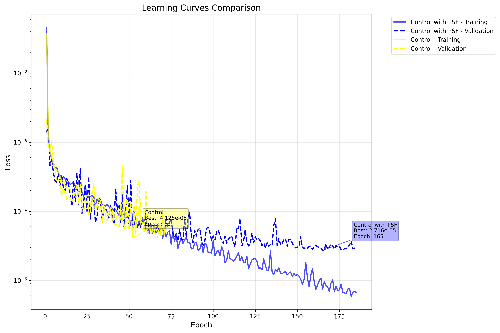
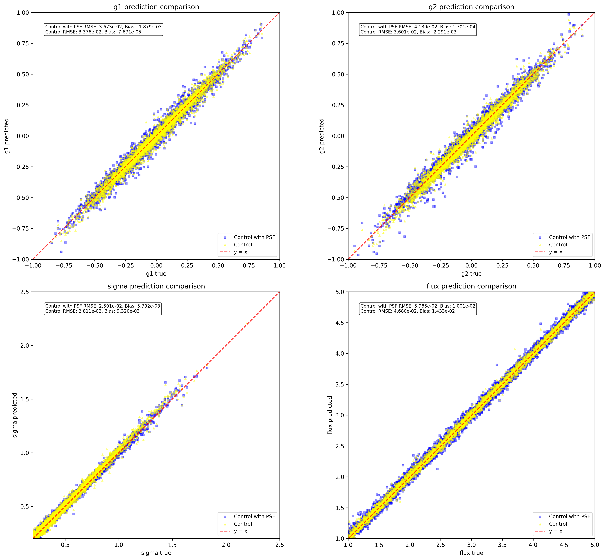
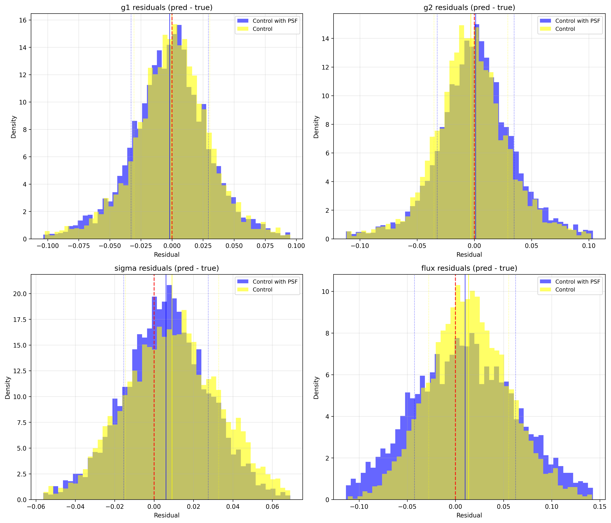

# ShearNet Notebook Output

Generated on: 2025-07-03 13:57:58

Output directory: `/home/adfield/ShearNet_Dev/notebooks/out`

---

==================================================

BENCHMARK CONFIGURATION

==================================================

Models to compare: ['Control with PSF', 'Control']

Include NGMix: False

==================================================


## Test Dataset Generation

Generated 5000 test samples

Image shape: (5000, 53, 53, 2)

Labels shape: (5000, 4)

```
test_images stats: shape=(5000, 53, 53, 2), min=-0.005, max=0.173, mean=0.001, std=0.004
```

```
test_labels stats: shape=(5000, 4), min=-0.949, max=4.996, mean=0.868, std=1.384
```

---


## Learning Curves Comparison

Control with PSF:

  Final training loss: 0.000007

  Final validation loss: 0.000028

  Best validation loss: 0.000027 at epoch 165

  Total epochs: 185

Control:

  Final training loss: 0.000059

  Final validation loss: 0.000058

  Best validation loss: 0.000041 at epoch 52

  Total epochs: 72



---


## Model Loading and Evaluation


Evaluating Control with PSF...


Evaluating Control...


All evaluations complete! Models: ['Control with PSF', 'Control']

---


## Model Evaluation Summary

============================================================


### EVALUATION SUMMARY

============================================================


Control with PSF:

  g1   : RMSE = 0.036731, Bias = -0.001879

  g2   : RMSE = 0.041395, Bias = 0.000170

  sigma: RMSE = 0.025013, Bias = 0.005792

  flux : RMSE = 0.059855, Bias = 0.010008


Control:

  g1   : RMSE = 0.033758, Bias = -0.000077

  g2   : RMSE = 0.036009, Bias = -0.002291

  sigma: RMSE = 0.028106, Bias = 0.009320

  flux : RMSE = 0.046803, Bias = 0.014326


Ready for plotting with 2 models

---


## Prediction Comparison Plots



---


## Residuals Comparison Plots



---


## Multi-model benchmark complete!

