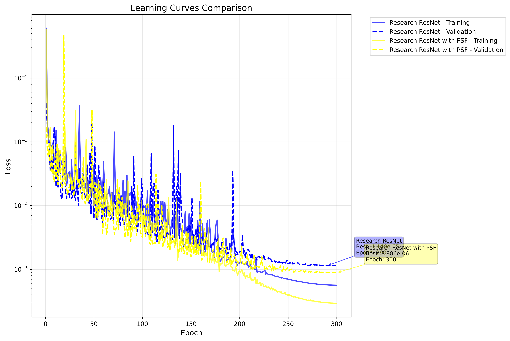
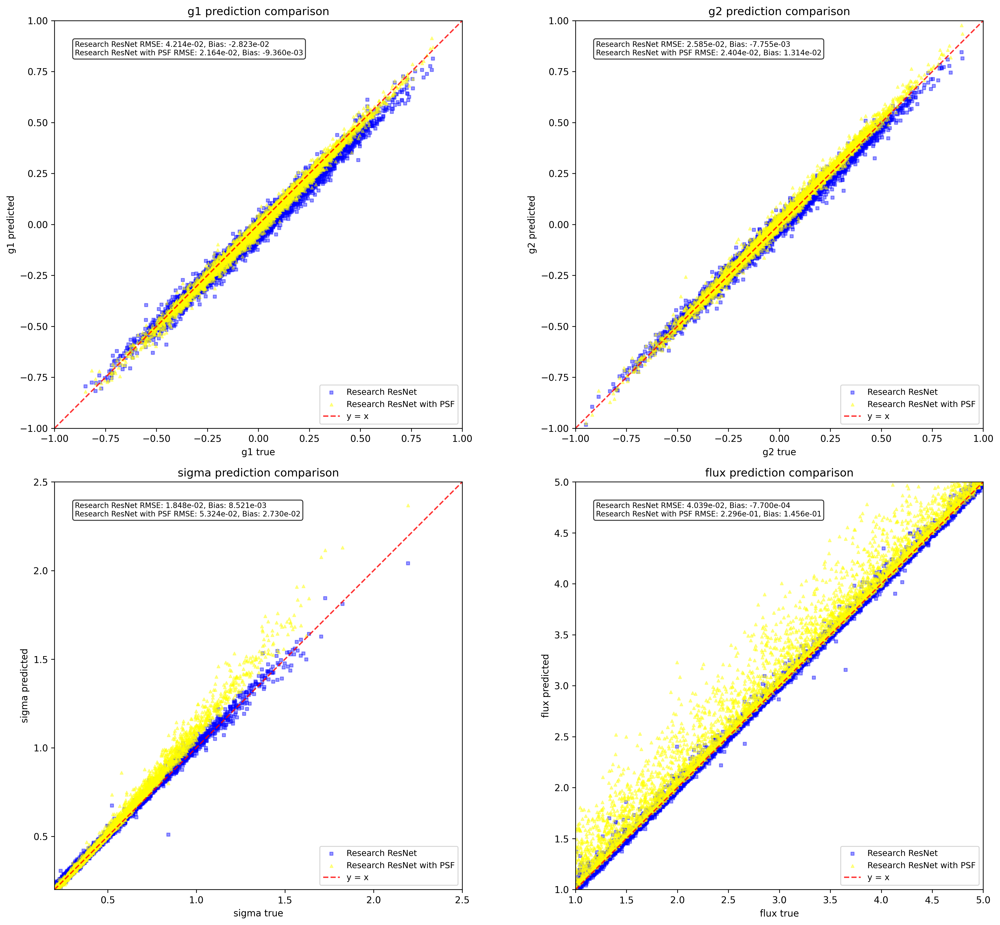
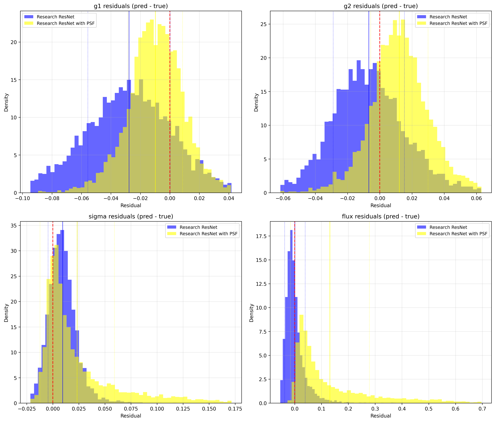

# ShearNet Notebook Output

Generated on: 2025-07-04 00:56:57

Output directory: `/home/adfield/ShearNet_Dev/notebooks/out`

---

==================================================

BENCHMARK CONFIGURATION

==================================================

Models to compare: ['Research ResNet', 'Research ResNet with PSF']

Include NGMix: False

==================================================


## Test Dataset Generation

Generated 5000 test samples

Image shape: (5000, 53, 53, 2)

Labels shape: (5000, 4)

```
test_images stats: shape=(5000, 53, 53, 2), min=-0.005, max=0.182, mean=0.001, std=0.004
```

```
test_labels stats: shape=(5000, 4), min=-0.949, max=4.999, mean=0.871, std=1.391
```

---


## Learning Curves Comparison

Research ResNet:

  Final training loss: 0.000006

  Final validation loss: 0.000011

  Best validation loss: 0.000011 at epoch 290

  Total epochs: 300

Research ResNet with PSF:

  Final training loss: 0.000003

  Final validation loss: 0.000009

  Best validation loss: 0.000009 at epoch 300

  Total epochs: 300



---


## Model Loading and Evaluation


Evaluating Research ResNet...


Evaluating Research ResNet with PSF...


All evaluations complete! Models: ['Research ResNet', 'Research ResNet with PSF']

---


## Model Evaluation Summary

============================================================


### EVALUATION SUMMARY

============================================================


Research ResNet:

  g1   : RMSE = 0.042140, Bias = -0.028233

  g2   : RMSE = 0.025845, Bias = -0.007755

  sigma: RMSE = 0.018477, Bias = 0.008521

  flux : RMSE = 0.040393, Bias = -0.000770


Research ResNet with PSF:

  g1   : RMSE = 0.021636, Bias = -0.009360

  g2   : RMSE = 0.024045, Bias = 0.013141

  sigma: RMSE = 0.053237, Bias = 0.027301

  flux : RMSE = 0.229632, Bias = 0.145590


Ready for plotting with 2 models

---


## Prediction Comparison Plots



---


## Residuals Comparison Plots



---


## Multi-model benchmark complete!

