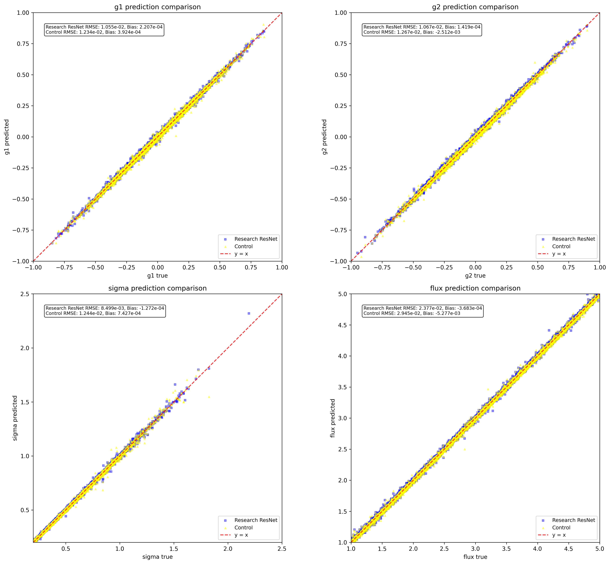

# ShearNet Notebook Output

Generated on: 2025-07-02 19:19:42

Output directory: `/home/adfield/ShearNet_Dev/notebooks/out`

---

==================================================

BENCHMARK CONFIGURATION

==================================================

Models to compare: ['Research ResNet', 'Control']

Include NGMix: False

==================================================


## Test Dataset Generation

Generated 5000 test samples

Image shape: (5000, 53, 53)

Labels shape: (5000, 4)

```
test_images stats: shape=(5000, 53, 53), min=-0.005, max=0.179, mean=0.001, std=0.005
```

```
test_labels stats: shape=(5000, 4), min=-0.949, max=4.999, mean=0.868, std=1.384
```

---


## Learning Curves Comparison

Research ResNet:

  Final training loss: 0.000096

  Final validation loss: 0.000130

  Best validation loss: 0.000130 at epoch 298

  Total epochs: 300

Control:

  Final training loss: 0.000110

  Final validation loss: 0.000183

  Best validation loss: 0.000177 at epoch 150

  Total epochs: 170


---


## Model Loading and Evaluation


Evaluating Research ResNet...

---


## Model Evaluation Summary

============================================================


### EVALUATION SUMMARY

============================================================


Ready for plotting with 0 models

---


## Model Loading and Evaluation


Evaluating Research ResNet...


Evaluating Control...


All evaluations complete! Models: ['Research ResNet', 'Control']

---


## Model Evaluation Summary

============================================================


### EVALUATION SUMMARY

============================================================


Research ResNet:

  g1   : RMSE = 0.010554, Bias = 0.000221

  g2   : RMSE = 0.010670, Bias = 0.000142

  sigma: RMSE = 0.008499, Bias = -0.000127

  flux : RMSE = 0.023772, Bias = -0.000368


Control:

  g1   : RMSE = 0.012341, Bias = 0.000392

  g2   : RMSE = 0.012673, Bias = -0.002512

  sigma: RMSE = 0.012440, Bias = 0.000743

  flux : RMSE = 0.029450, Bias = -0.005277


Ready for plotting with 2 models

---


## Prediction Comparison Plots



---


## Residuals Comparison Plots


---


## Multi-model benchmark complete!

