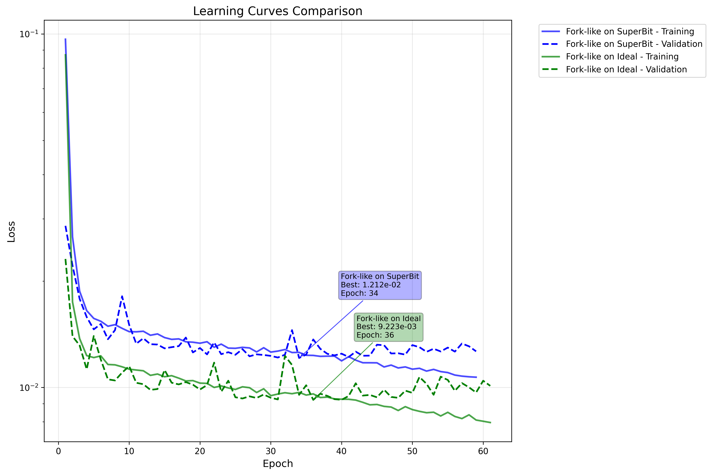
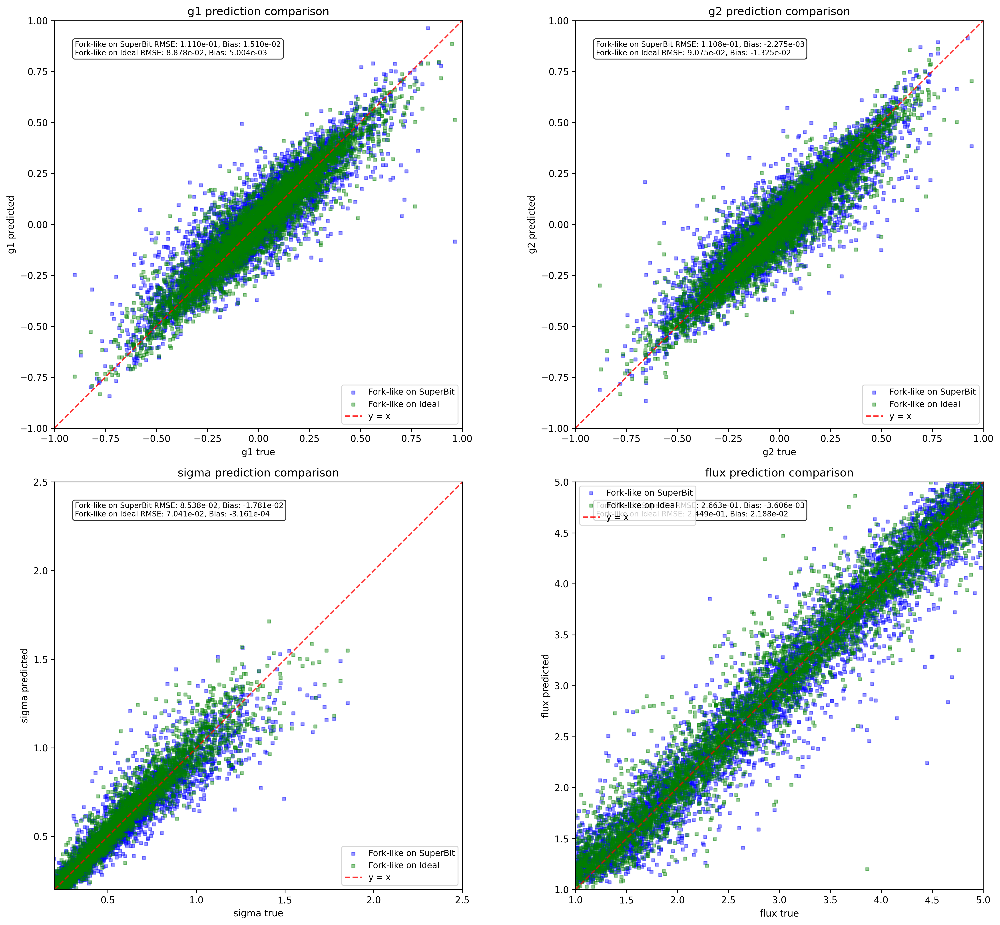
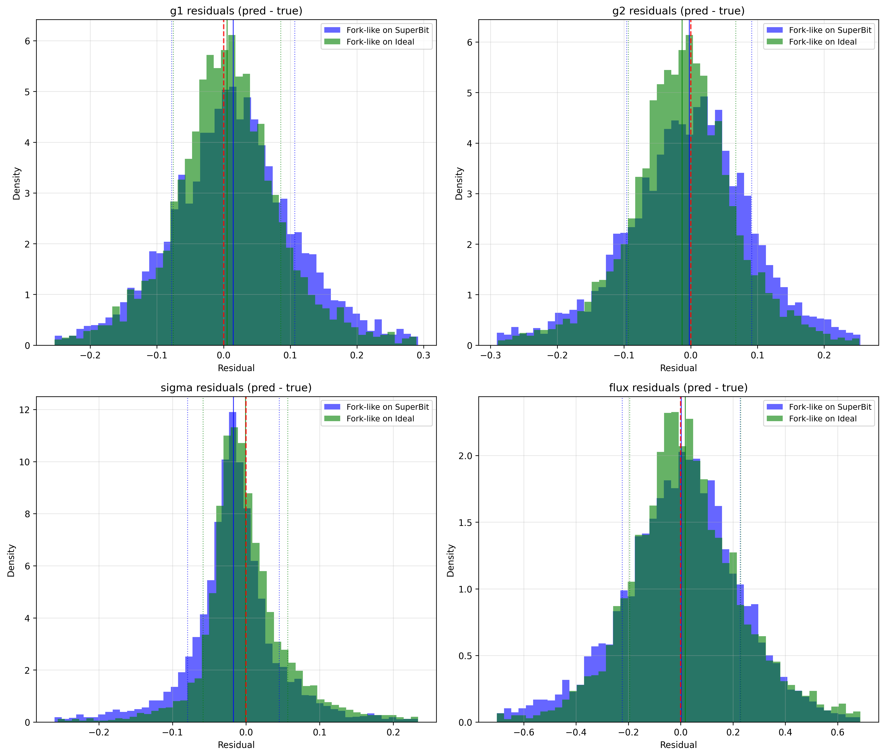

# ShearNet Notebook Output

Generated on: 2025-09-07 23:02:18

Output directory: `/home/adfield/ShearNet/notebooks/out`

---

============================================================


## MODULAR BENCHMARK CONFIGURATION

============================================================

ShearNet models to compare: ['Fork-like on SuperBit', 'Fork-like on Ideal']

NGmix configs to compare: NO NGMIX

Total methods to evaluate: 2

============================================================


## Test Dataset Generation

Generated 5000 shared test samples for plotting

Galaxy image shape: (5000, 53, 53)

PSF image shape: (5000, 53, 53)

Labels shape: (5000, 4)

```
test_galaxy_images stats: shape=(5000, 53, 53), min=-0.000, max=0.177, mean=0.001, std=0.005
```

```
test_psf_images stats: shape=(5000, 53, 53), min=-0.000, max=0.049, mean=0.000, std=0.003
```

```
test_labels stats: shape=(5000, 4), min=-0.949, max=4.999, mean=0.870, std=1.390
```

---


## Learning Curves Comparison

Fork-like on SuperBit training stats:

  Final training loss: 0.010691

  Final validation loss: 0.012652

  Best validation loss: 0.012118 at epoch 34

  Total epochs: 59

Fork-like on Ideal training stats:

  Final training loss: 0.007958

  Final validation loss: 0.010105

  Best validation loss: 0.009223 at epoch 36

  Total epochs: 61



---


## Model Loading and Evaluation


### 
Evaluating Fork-like on SuperBit...

Loading training config for Fork-like on SuperBit: /home/adfield/ShearNet/plots/fork-like_high_noise_superbits/training_config.yaml

Generating test data for Fork-like on SuperBit:

  Samples: 5000

  PSF sigma: 0.25

  Noise SD: 0.01

  Experiment: superbit

  Stamp size: 53

  Pixel size: 0.141

  PSF shear: False

  Process PSF: True

Loading architecture from: /home/adfield/ShearNet/plots/fork-like_high_noise_superbits/architecture.py

Model type: fork-like

Galaxy type: research_backed, PSF type: forklens_psf

Successfully loaded model: ForkLike

Found 1 matching directories for Fork-like on SuperBit: ['fork-like_high_noise_superbits59']

Loading Fork-like on SuperBit from: /home/adfield/ShearNet/model_checkpoint/fork-like_high_noise_superbits59

Model checkpoint loaded successfully.

Successfully evaluated Fork-like on SuperBit

  MSE: 1.285e-02

  Bias: -2.148e-03


### 
Evaluating Fork-like on Ideal...

Loading training config for Fork-like on Ideal: /home/adfield/ShearNet/plots/fork-like_high_noise_ideals/training_config.yaml

Generating test data for Fork-like on Ideal:

  Samples: 5000

  PSF sigma: 0.25

  Noise SD: 0.01

  Experiment: ideal

  Stamp size: 53

  Pixel size: 0.141

  PSF shear: False

  Process PSF: True

Loading architecture from: /home/adfield/ShearNet/plots/fork-like_high_noise_ideals/architecture.py

Model type: fork-like

Galaxy type: research_backed, PSF type: forklens_psf

Successfully loaded model: ForkLike

Found 1 matching directories for Fork-like on Ideal: ['fork-like_high_noise_ideals61']

Loading Fork-like on Ideal from: /home/adfield/ShearNet/model_checkpoint/fork-like_high_noise_ideals61

Model checkpoint loaded successfully.

Successfully evaluated Fork-like on Ideal

  MSE: 1.013e-02

  Bias: +3.331e-03


### 
No NGmix configurations to evaluate.


All evaluations complete! Methods: ['Fork-like on SuperBit', 'Fork-like on Ideal']

---


## Model Evaluation Summary

============================================================


### EVALUATION SUMMARY

============================================================


Fork-like on SuperBit (SHEARNET):

  Test Configuration:

    Samples: 5000

    PSF σ: 0.25

    Noise SD: 1.0e-02

    Experiment: superbit

    PSF Shear: False

  Performance:

    Overall MSE: 1.285e-02

    Overall Bias: -2.148e-03

    g1 MSE: 6.159e-03

    g2 MSE: 6.141e-03

    σ MSE: 3.645e-03

    Flux MSE: 3.547e-02

    Evaluation Time: 28.72 seconds


Fork-like on Ideal (SHEARNET):

  Test Configuration:

    Samples: 5000

    PSF σ: 0.25

    Noise SD: 1.0e-02

    Experiment: ideal

    PSF Shear: False

  Performance:

    Overall MSE: 1.013e-02

    Overall Bias: +3.331e-03

    g1 MSE: 3.941e-03

    g2 MSE: 4.118e-03

    σ MSE: 2.479e-03

    Flux MSE: 3.000e-02

    Evaluation Time: 12.66 seconds


Ready for plotting with 2 methods

---


## Prediction Comparison Plots



---


## Residuals Comparison Plots



---

