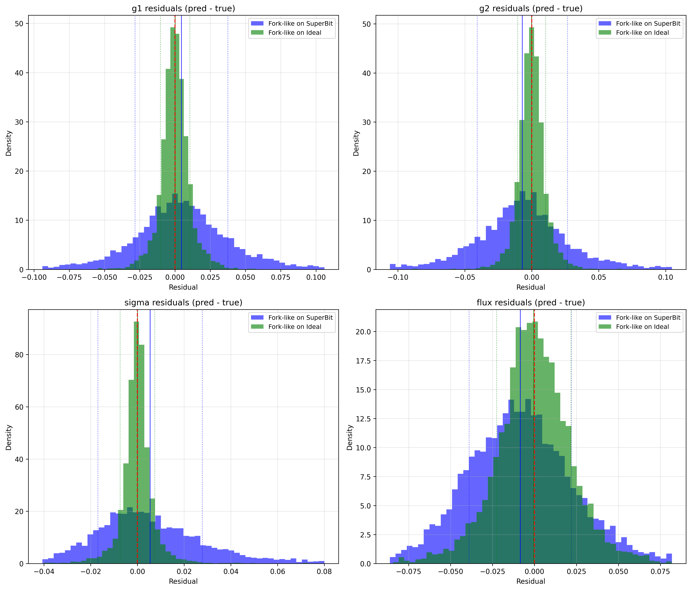

# ShearNet Notebook Output

Generated on: 2025-09-08 00:39:23

Output directory: `/home/adfield/ShearNet/notebooks/out`

---

============================================================


## MODULAR BENCHMARK CONFIGURATION

============================================================

ShearNet models to compare: ['Fork-like on SuperBit', 'Fork-like on Ideal']

NGmix configs to compare: NO NGMIX

Total methods to evaluate: 2

============================================================


## Test Dataset Generation

Generated 5000 shared test samples for plotting

Galaxy image shape: (5000, 53, 53)

PSF image shape: (5000, 53, 53)

Labels shape: (5000, 4)

```
test_galaxy_images stats: shape=(5000, 53, 53), min=-0.000, max=0.178, mean=0.001, std=0.005
```

```
test_psf_images stats: shape=(5000, 53, 53), min=-0.000, max=0.049, mean=0.000, std=0.003
```

```
test_labels stats: shape=(5000, 4), min=-0.949, max=5.000, mean=0.876, std=1.398
```

---


## Learning Curves Comparison

Fork-like on SuperBit training stats:

  Final training loss: 0.000909

  Final validation loss: 0.000806

  Best validation loss: 0.000364 at epoch 44

  Total epochs: 69

Fork-like on Ideal training stats:

  Final training loss: 0.000098

  Final validation loss: 0.000126

  Best validation loss: 0.000126 at epoch 289

  Total epochs: 300


---


## Model Loading and Evaluation


### 
Evaluating Fork-like on SuperBit...

Loading training config for Fork-like on SuperBit: /home/adfield/ShearNet/plots/fork-like_-3_noise_superbits/training_config.yaml

Generating test data for Fork-like on SuperBit:

  Samples: 5000

  PSF sigma: 0.25

  Noise SD: 0.001

  Experiment: superbit

  Stamp size: 53

  Pixel size: 0.141

  PSF shear: False

  Process PSF: True

Loading architecture from: /home/adfield/ShearNet/plots/fork-like_-3_noise_superbits/architecture.py

Model type: fork-like

Galaxy type: research_backed, PSF type: forklens_psf

Successfully loaded model: ForkLike

Found 1 matching directories for Fork-like on SuperBit: ['fork-like_-3_noise_superbits69']

Loading Fork-like on SuperBit from: /home/adfield/ShearNet/model_checkpoint/fork-like_-3_noise_superbits69

Model checkpoint loaded successfully.

Successfully evaluated Fork-like on SuperBit

  MSE: 8.863e-04

  Bias: -9.339e-04


### 
Evaluating Fork-like on Ideal...

Loading training config for Fork-like on Ideal: /home/adfield/ShearNet/plots/fork-like_-3_noise_ideals/training_config.yaml

Generating test data for Fork-like on Ideal:

  Samples: 5000

  PSF sigma: 0.25

  Noise SD: 0.001

  Experiment: ideal

  Stamp size: 53

  Pixel size: 0.141

  PSF shear: False

  Process PSF: True

Loading architecture from: /home/adfield/ShearNet/plots/fork-like_-3_noise_ideals/architecture.py

Model type: fork-like

Galaxy type: research_backed, PSF type: forklens_psf

Successfully loaded model: ForkLike

Found 1 matching directories for Fork-like on Ideal: ['fork-like_-3_noise_ideals300']

Loading Fork-like on Ideal from: /home/adfield/ShearNet/model_checkpoint/fork-like_-3_noise_ideals300

Model checkpoint loaded successfully.

Successfully evaluated Fork-like on Ideal

  MSE: 1.319e-04

  Bias: -1.023e-04


### 
No NGmix configurations to evaluate.


All evaluations complete! Methods: ['Fork-like on SuperBit', 'Fork-like on Ideal']

---


## Model Evaluation Summary

============================================================


### EVALUATION SUMMARY

============================================================


Fork-like on SuperBit (SHEARNET):

  Test Configuration:

    Samples: 5000

    PSF σ: 0.25

    Noise SD: 1.0e-03

    Experiment: superbit

    PSF Shear: False

  Performance:

    Overall MSE: 8.863e-04

    Overall Bias: -9.339e-04

    g1 MSE: 1.026e-03

    g2 MSE: 1.115e-03

    σ MSE: 4.071e-04

    Flux MSE: 9.967e-04

    Evaluation Time: 29.15 seconds


Fork-like on Ideal (SHEARNET):

  Test Configuration:

    Samples: 5000

    PSF σ: 0.25

    Noise SD: 1.0e-03

    Experiment: ideal

    PSF Shear: False

  Performance:

    Overall MSE: 1.319e-04

    Overall Bias: -1.023e-04

    g1 MSE: 5.680e-05

    g2 MSE: 5.508e-05

    σ MSE: 4.121e-05

    Flux MSE: 3.743e-04

    Evaluation Time: 12.42 seconds


Ready for plotting with 2 methods

---


## Prediction Comparison Plots


---


## Residuals Comparison Plots



---

